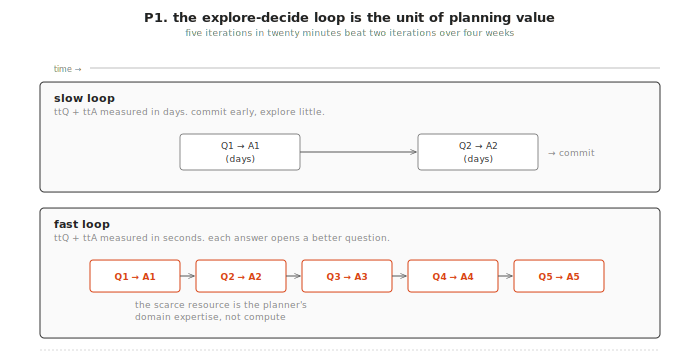
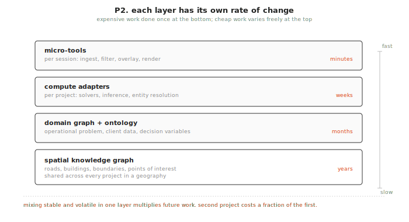
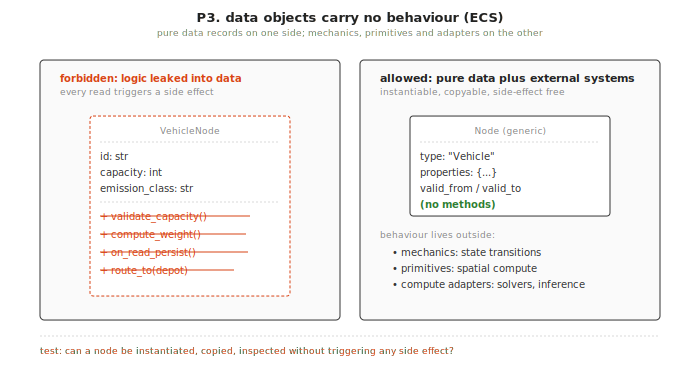
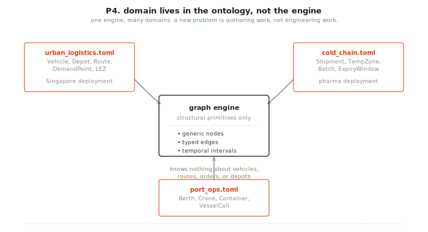
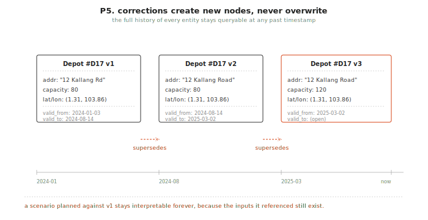
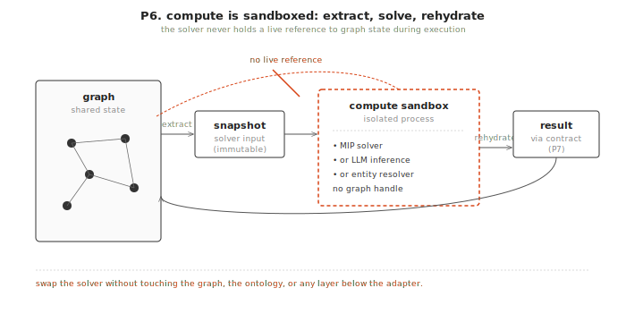
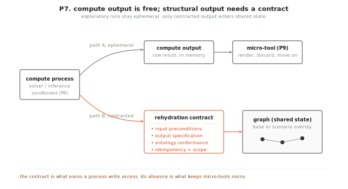
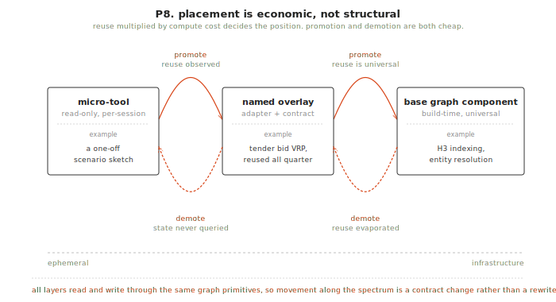
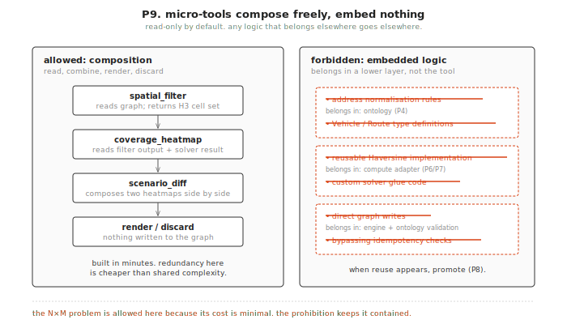

+++
title = "Critical thinking infrastructure: core principles and architectural decisions"
date = "2026-03-24"
+++

**Updated: 2026-04-09** | *This work accompanies my application to the [Encode AI fellowship](https://encode.pillar.vc/).*

This document sits upstream of all engineering documents for the critical thinking infrastructure platform. It establishes the nine principles that design and implementation decisions must satisfy, with the motivation for each, a concrete test, and a supporting figure. When a downstream document drifts, this is the reference to check. When a principle needs justification, this is the document to point to.

The document depends on the *Logistics Planning Platform Architecture Overview*, which sets out the problem statement and value proposition. It governs the *Unified Technical Architecture Specification* and all subsequent design, implementation, and build specification documents.

## How to use this document

Each principle has four parts. The principle itself is the decision rule, stated as an imperative. The motivation describes the failure mode it prevents, grounded in observed failures of logistics systems and in the rewilding software engineering methodology. The test is a concrete question that can be asked of any design decision to determine whether it satisfies or violates the principle. The figure is a diagram intended to make the principle legible at a glance, and downstream documents can reference it directly.

A design decision that cannot pass the test for a principle it claims to satisfy should be revised rather than the principle. Principles may only be revised by explicit agreement with reference to a new failure mode or a change in the business problem.

## P1. Minimise time to question and time to answer

**The principle.** Every architectural decision is evaluated against a single user need, which is that a planner must be able to ask a question, receive an answer, and ask a better question within a single working session. Time to question (ttQ) is the time from having an idea to being able to pose it to the system. Time to answer (ttA) is the time from posing a question to receiving a useful response. Both must be minimised, because an architecture that is internally elegant but slow for planners to use has failed its primary purpose.

**The motivation.** The quality of a logistics plan is determined by the number of questions a planner can ask and answer before committing to a solution. In traditional logistics planning the data infrastructure must be rebuilt for every project, so when answers take hours or days, planners ask few questions, commit early, and produce plans that are defensible but shallow. The real cost lies in the questions that are never asked and the alternatives that are never explored, rather than in the time spent on analysis.

This principle is grounded in the rewilding software engineering methodology of Girba and Wardley, which argues that software should be shaped by the questions people actually ask rather than by the abstract elegance of the system serving those questions. The explore-decide loop of ask, answer, and refine is the unit of planning value, and the platform exists to compress that loop rather than to optimise internal metrics that do not serve it. Five iterations of the loop in twenty minutes produces a more robust plan than two iterations over four weeks, and the planner's domain expertise, in the form of their ability to formulate the right question at the right moment, is the scarce resource that the platform should amplify rather than replace.

**The test.** *Does this decision make it faster for a planner to ask a question or get an answer?* If the answer is no, and the decision serves only internal elegance, engineering cleanliness, or hypothetical future flexibility, it does not belong in the core. Every principle that follows is ultimately in service of this one.

## P2. Separate stable from volatile

**The principle.** Logistics problems operate on physical infrastructure that changes slowly. That infrastructure is shared across all projects in a geography, and it must be invested in heavily precisely because the investment amortises across many projects. What varies between projects, meaning the operational question, the client data, and the decision variables, must be cleanly separated from what is stable. Each layer must have a different rate of change and a different cost structure.

**The motivation.** The N×M integration trap arises when stable and volatile concerns are mixed in the same layer. When the spatial foundation is rebuilt per project, every project pays the full infrastructure cost. When domain vocabulary is baked into the engine, adding a new problem type requires touching code that should never change. When solver logic leaks into the data model, swapping a solver requires a data migration. Each mixing of stable and volatile concerns multiplies future work, and separating them means that expensive work is done once while cheap work varies freely. The consequence is that the second project in a geography costs a fraction of the first, and the tenth costs almost nothing to set up.

**The test.** *Can the spatial knowledge graph be queried without loading any client data? Can a new client project begin without modifying the base graph or the engine? Can a new problem domain be added without changing any layer below the ontology?* If any answer is no, then stable and volatile have been mixed in a way that will multiply future cost.

## P3. Data objects carry no behaviour (ECS)

**The principle.** All entities in the graph are pure data records with properties only, no methods, no business logic, and no embedded rules. All behaviour lives in external systems, with mechanics handling state transitions, primitives handling spatial computation, and compute adapters handling optimisation and inference. This is the Entity-Component-System (ECS) principle applied to logistics data.

**The motivation.** Logic leakage is the most insidious failure mode in logistics systems. When business logic is embedded in data objects, such as an order that knows how to calculate its own weight, a vehicle that validates its own capacity constraints, or a node that triggers side effects when read, the system loses the ability to perform parallelised, side-effect-free operations. Any change to the data schema creates cascading breakages in the logic embedded within it, and shadow-mode simulations become impossible because instantiating an object triggers its embedded persistence routines.

This failure mode has been documented in ORM-based logistics systems, in Neo4j OGM implementations where `@NodeEntity` annotations embed persistence concerns into domain objects, and in microservice migrations where God Services absorb business rules that refuse to be cleanly bounded. The ECS prohibition on logic in components acts as an architectural antibody against this failure rather than as a design preference.

**The test.** *Can any node or edge in the graph be instantiated, copied, and inspected without triggering any side effect? Does any node or edge contain a method, validation rule, computed property, or conditional?* If any answer is no, behaviour has leaked into data.

## P4. Domain knowledge lives in the ontology, not the engine

**The principle.** The graph engine knows only structural primitives, namely generic nodes with typed property maps, directed edges with typed property maps, and temporal validity intervals. It has no built-in concept of a vehicle, a route, a demand point, or any other domain entity. All domain vocabulary, including which node types are valid, which edge types are valid, what properties they carry, and what constraints apply, lives in a Domain Ontology that takes the form of a declarative configuration file loaded at runtime and versioned independently of the engine.

**The motivation.** Hard-coding domain types into the engine is the mechanism by which logic leakage re-enters through the back door even after the ECS principle has been applied. When an engine defines `VehicleNode`, `RouteEdge`, and `DemandPoint` as first-class types, adding a supply chain domain requires modifying the engine, and changing a property name requires a data migration. The engine becomes a God Service by accumulation rather than by design.

The ontology framework prevents this by making domain semantics a runtime configuration rather than a compile-time constant. Different deployments load different ontologies, and the engine enforces the ontology's rules without containing any of its concepts. New domains become authoring work rather than engineering work.

**The test.** *Can a new problem domain, such as cold-chain pharmaceuticals, port logistics, or supply chain procurement, be added by authoring a TOML or JSON configuration file with zero code changes to the engine?* If the answer is no, domain knowledge has leaked into the engine.

## P5. Immutability and temporal lineage

**The principle.** State changes produce new nodes linked to old nodes via directed transition arcs. Existing nodes and edges are never overwritten, the full history of every entity is preserved in the graph, and state is queryable at any past timestamp. A correction creates a new version rather than erasing the previous one.

**The motivation.** In-place mutation silently destroys the audit trail. When a client corrects a property address and the old record is overwritten, the scenario that was planned against the old record becomes uninterpretable because its inputs no longer exist. Plan-versus-actual comparison requires that both the plan and the actual state at planning time are permanently available, and contract-level audit trails require that every state transition is traceable to a cause and a timestamp.

Immutability also resolves the update cascade problem. When a node is superseded, the old node remains queryable, and scenarios that referenced the old node can be detected as derived from superseded data by checking `valid_to` timestamps, without any additional machinery.

**The test.** *Is there any operation in the system that overwrites or deletes an existing node or edge? Can the complete state of the graph at any past timestamp be reconstructed from current data alone?* If any answer is no, temporal lineage has been broken.

## P6. Compute is sandboxed

**The principle.** All heavyweight computation, including optimisation solvers, inference models, classifiers, and enrichment pipelines, runs completely decoupled from the graph. A compute process extracts what it needs before execution, runs in isolation, and writes results back after execution, without ever holding a live reference to graph state during computation.

**The motivation.** If solvers can read and write graph state during execution, three problems arise. The first is non-determinism, because the graph state a solver reads mid-execution may differ from the state it started with, producing results that cannot be reproduced or audited. The second is coupling, because solver-specific data structures bleed into the graph model, making the solver impossible to swap without a data migration. The third is testability, because a solver that holds live graph references cannot be unit-tested against a fixed input.

The extract-compute-rehydrate pipeline is the concrete mechanism that enforces this sandbox. It also makes the impedance between the graph representation and the solver representation explicit and manageable, because the extraction step handles the translation, the rehydration step handles the reverse mapping, and the solver itself remains oblivious to the graph.

**The test.** *Does any compute process hold a live reference to graph state during its execution? Can any solver be replaced with a different solver without modifying the graph, the ontology, or any layer below the adapter?* If any answer is no, the compute sandbox has been violated.

## P7. Compute output is free, structural output requires a contract

**The principle.** A compute process produces two kinds of output. Compute output is the raw artefact returned by the process, such as a solver's response, an inference model's scored list, or entity resolution candidate pairs. It is ephemeral by default and can be consumed directly by micro-tools without any graph write. Structural output consists of compute results written into the graph as nodes and edges, conforming to the loaded ontology, and becoming part of the shared state that other processes can depend on. Structural output requires a formalised rehydration contract before it may be written.

The rehydration contract covers five elements. The first is an explicit input contract, which specifies what graph state must exist before the process runs and is enforced as a hard precondition. The second is an output contract, which specifies what node and edge types will be written and is defined in the ontology. The third is ontology conformance, which requires that all writes are validated against the loaded ontology at the write boundary. The fourth is idempotency, which requires that identical inputs produce identical outputs and that there are no side effects outside the graph. The fifth is scope declaration, which requires the process to declare upfront whether it writes to the base graph or to a named scenario overlay.

**The motivation.** Without this distinction, two failure modes emerge. If all compute output is forced into the graph, exploratory computation becomes expensive because every solver sketch, every threshold calibration run, and every exploratory inference pass creates permanent graph state, and ttA rises because the commitment cost is baked into every computation. If structural output can be written without a contract, arbitrary data enters shared state without guarantees of correctness, reproducibility, or scope, and downstream processes that depend on that state inherit its ambiguity.

The contract is what earns a compute process write access to shared state, and the absence of a contract is what keeps micro-tools micro.

**The test.** *Does every process that writes to the graph have an explicit, documented input contract, output contract, ontology conformance requirement, idempotency guarantee, and scope declaration? Can ephemeral compute output be consumed by a micro-tool without triggering any graph write?* If the first answer is no for any writing process, shared state is unprotected. If the second answer is no, ttA has been unnecessarily inflated.

## P8. Materialisation is an economic decision, not a structural one

**The principle.** There is no permanent architectural distinction between a micro-tool, a named compute overlay, and a base graph component. These are positions on a reuse-cost spectrum, and the correct position for any compute process is determined by observed reuse relative to compute cost, anchored always to whether materialisation compresses ttQ or ttA for planners. Any process can move along the spectrum as evidence justifies it, and promotion and demotion must both be cheap.

H3 indexing and entity resolution are compute processes that have been promoted to build-time infrastructure because their reuse is universal and their output is foundational to every query. A VRP solver run that a planner discards after viewing the KPI summary is a process whose output need never be materialised. The same VRP run whose output becomes the basis for a submitted tender bid is a process whose structural output is worth committing.

**The motivation.** Classifying processes as permanently infrastructure or permanently ephemeral at design time is a prediction about future usage patterns that will frequently be wrong. An over-promoted process creates permanent graph state that is never queried and cannot be easily removed, while an under-promoted process is recomputed identically on every project, inflating ttA without architectural justification. The cost of wrong classification must be low in both directions.

The constraint that makes movement cheap in both directions is that all layers read and write through the same graph primitives. If a micro-tool uses a different data access path than a compute adapter, promotion requires a rewrite rather than a contract formalisation, and if a promoted process uses specialised write paths, demotion requires unpicking those paths. Uniform primitives are what make the spectrum traversable.

**The test.** *Is the placement of this process on the spectrum driven by observed reuse multiplied by compute cost, anchored to whether materialisation compresses ttQ or ttA? Can the process be promoted from micro-tool to named overlay, or demoted from base graph to overlay, without touching the engine, the ontology framework, or any other process?* If promotion or demotion requires engine changes, the spectrum is not traversable and placement has become structural.

## P9. Micro-tools compose freely, embed nothing

**The principle.** Micro-tools are read-only by default. They read from any layer, consume compute output directly without graph writes, compose with other micro-tools, and render results ephemerally. A micro-tool whose output is consumed once and discarded has no reason to write to the graph. When a micro-tool's output begins to be reused across sessions, by other tools, or as input to further computation, that reuse is the promotion signal, and the computation should become a named compute adapter with a formal rehydration contract.

What micro-tools must never do is embed logic that belongs elsewhere, including domain rules that should live in the ontology, reusable computation that should live in a compute adapter, or structural integrity enforcement that should live in the engine. A micro-tool that begins encoding reusable domain logic is an early symptom of logic leakage.

**The motivation.** Micro-tools are the layer where the N×M problem is permitted to exist, because at this layer its cost is minimal. A micro-tool takes minutes to hours to build, and an analysis tool built for one project that turns out to be useful on ten projects costs almost nothing to have built multiple times. The architecture accepts this redundancy at the micro-tool layer precisely because it has eliminated it at all lower layers.

The risk is that micro-tools accumulate logic that should live elsewhere. An ingestion tool that embeds address normalisation rules is a logic leakage risk, because if those rules change, every tool that embedded them must be updated rather than just the ontology. An analysis tool that re-implements spatial primitives is a correctness risk, because two implementations of Haversine distance will eventually diverge. The prohibition on embedding is the mechanism that keeps the micro-tool layer cheap and the lower layers authoritative.

**The test.** *Does this tool embed any domain rule that should be in the ontology, any reusable computation that should be a compute adapter, or any structural integrity logic that should be in the engine? Does this tool require a graph write, and if so, is that write going through standard graph primitives with ontology validation?* If the first answer is yes for any category, logic has leaked into the tool layer. If the second answer reveals a write that bypasses the ontology, the tool has acquired write privileges it has not earned.

## Summary reference

| #  | Principle                                         | Core failure prevented                          | One-line test                                                |
|----|---------------------------------------------------|-------------------------------------------------|--------------------------------------------------------------|
| P1 | Minimise ttQ and ttA                              | Planning value left on the table                | Does this compress the explore-decide loop?                  |
| P2 | Separate stable from volatile                     | N×M integration trap                            | Can each layer change independently?                         |
| P3 | Data carries no behaviour (ECS)                   | Logic leakage into a God service                | Can any node be instantiated without side effects?           |
| P4 | Domain knowledge in ontology, not engine          | Engine becomes a God service by accumulation    | Can a new domain be added with only a config file?           |
| P5 | Immutability and temporal lineage                 | Silent destruction of the audit trail           | Can any past state be reconstructed without special tooling? |
| P6 | Compute is sandboxed                              | Non-determinism, solver coupling, untestability | Can any solver be swapped without touching the graph?        |
| P7 | Compute output free, structural output contracted | Inflated ttA and unprotected shared state       | Does every graph-writing process have a full contract?       |
| P8 | Materialisation is economic, not structural       | Wrong-classification cost too high              | Can any process be promoted or demoted without engine changes? |
| P9 | Micro-tools compose freely, embed nothing         | Logic leakage through the tool layer            | Does this tool embed logic that belongs in a lower layer?    |

This document is stable. Changes require explicit justification against a new failure mode or a change in the business problem, and it is not updated in response to implementation decisions. Implementation decisions are updated in response to it.
