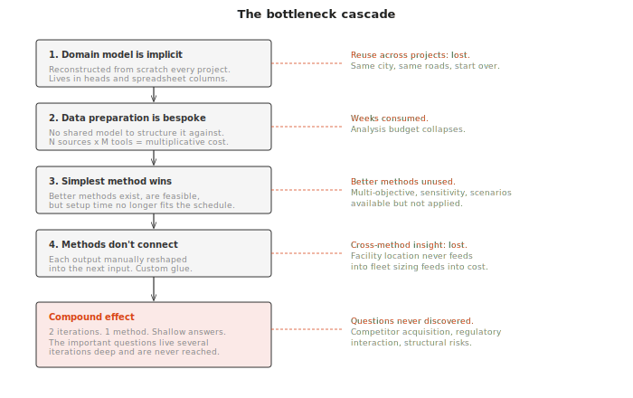
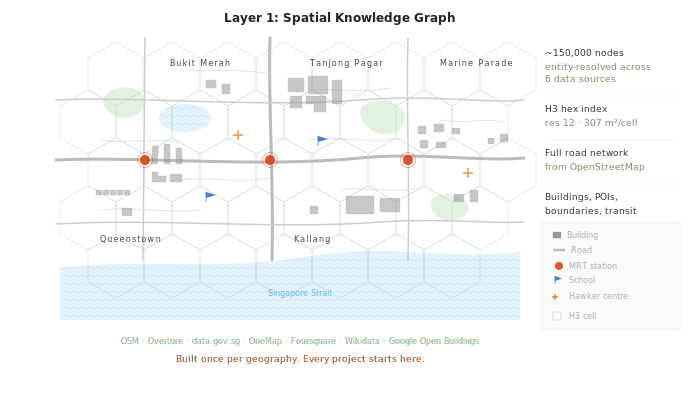
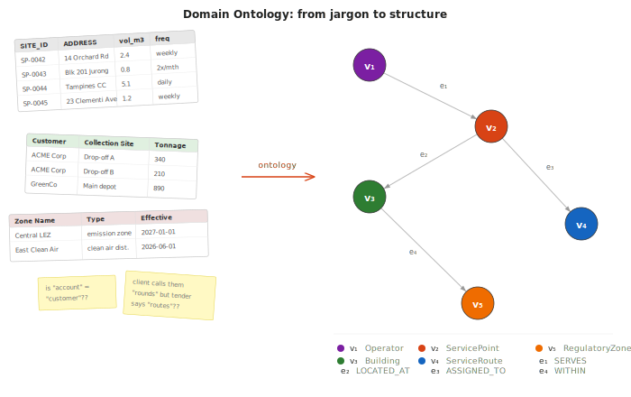
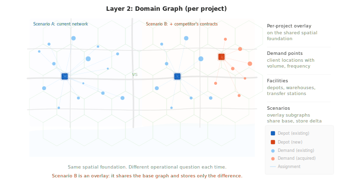
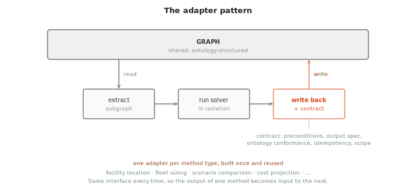
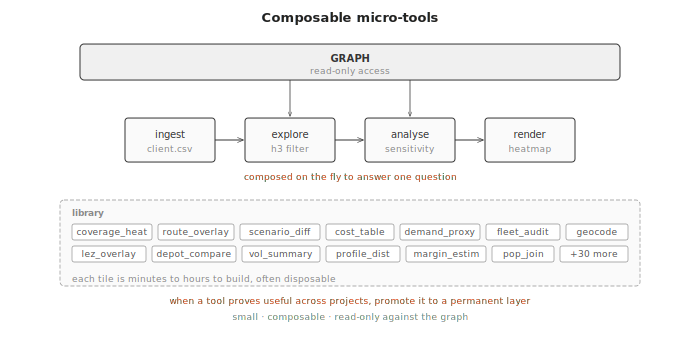
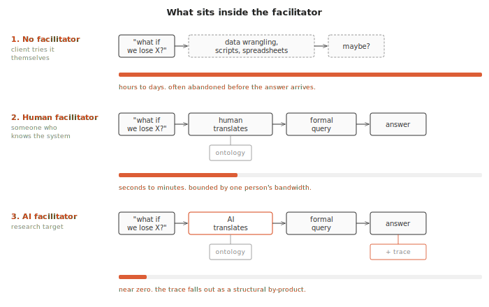

+++
title = "Building critical thinking infrastructure"
date = "2026-04-03"
draft = false
description = "A constructive proposal for AI-augmented decision support on spatial knowledge graphs."
+++

*A companion to [When Deliberation Meets Reality](/posts/when-deliberation-meets-reality/), which argued that the missing precondition for collective flourishing is critical thinking infrastructure that operates fast enough to survive contact with reality. This post describes what that infrastructure looks like.*

The [previous post](/posts/when-deliberation-meets-reality/) proposed a hypothesis: that analytically superior methods are universally abandoned under pressure, despite their rigour, because they are too slow to fit inside the window where decisions actually get made. If that hypothesis holds, then the binding constraint on decision quality is time rather than analytical sophistication, specifically the time it takes to formulate a question (ttQ) and receive a useful answer (ttA). When those times are large, decision-makers default to gut feel regardless of what tools are available. When they are small enough to permit rapid iteration, decisions improve because each answer opens a better question than the last.

To supplement the argument, this post presents a constructive proposal. What would a system look like that actually compresses ttQ and ttA to the point where rigorous analysis fits inside the decision window?

The architecture described here has been partly developed through a combination of commercial deployment and design research. It builds on logistics planning platforms that have been stress-tested against real operational decisions worth hundreds of millions of dollars. Different versions have been running in production since 2020, with earlier versions dating to 2016. What follows is an honest description of what works, what remains to be built, and where the open research questions are.

## Where the time actually goes

*Hypothesis: the cost of asking a strategic question about a physical system is dominated by a cascade of bottlenecks that compound on each other, starting with the absence of a shared domain model and ending with the questions that are never discovered.*

Consider a logistics company deciding whether to bid on a government contract worth hundreds of millions over five years. The questions that determine whether they win or lose are strategic: can we service this geography profitably given our existing infrastructure? Where are the gaps between what we currently operate and what the tender requires? Our three competitors went into administration last year; should we acquire their contracts, and which ones are worth taking on? The government is introducing low-emission zones next year; what percentage of our current operations fall inside them, and what does compliance cost us?

Each of these questions has a quantitative answer that depends on spatial data: the geography, the road network, the building stock, the regulatory boundaries, the locations of existing infrastructure. Analytical methods to answer them exist, and many are computationally cheap by today's standards. The problem is everything that stands between the question and the method.

The first bottleneck is the domain model. Every project carries an implicit ontology: what counts as a "service point," how "coverage" is defined, what "profitability" means in terms of cost components, how the client's operational categories map onto geographic and regulatory boundaries. This domain knowledge is never formalised. It lives in the tender documents, the heads of experienced planners, in the column names of spreadsheets, in the assumptions buried inside previous analyses. It often gets reconstructed from scratch on every project, which is why data from one engagement cannot be reused on the next, even when both operate in the same city.

The second bottleneck is data preparation. Geocoding thousands of addresses, computing distances across the road network, cleaning and spatially locating property data, mapping administrative and regulatory boundaries, matching the client's data against authoritative sources. This work is repetitive across projects, but because there is no shared domain model to structure it against, each transformation is bespoke.

The third bottleneck is method selection. With most of the timeline consumed by the first two, the team reaches for the simplest analytical method that can produce a defensible answer in the remaining time. More sophisticated approaches, multi-objective optimisation, spatial sensitivity analysis, scenario comparison across parameter ranges, are available and computationally feasible, but each one requires its own setup, calibration, and interpretation time that the schedule no longer permits.

The fourth is integration between methods. Running the output of a facility location model into a fleet sizing calculation into a cost projection requires custom glue between each step. Without a shared data layer, each method's output has to be manually reshaped into the next method's input.

These bottlenecks compound. A four-week tender timeline might produce two iterations of the explore-decide cycle using a single method. The plan is defensible, because two good answers were produced. It is also shallow, because the methods that would have revealed trade-offs, risks, and structural weaknesses were never applied. And the deepest cost is in the questions that are never asked at all. The question about acquiring a competitor's contracts is never formulated, because you only discover it after several iterations of analysing the competitive landscape, and the bottlenecks prevent you from getting that far. The important questions live several iterations deep, and the cascade of setup costs keeps you from reaching them.

## The architectural response

*Hypothesis: the bottleneck cascade can be broken by formalising the domain model, pre-building the stable spatial foundation, and designing the analytical layer for composability across methods. Each intervention addresses a different bottleneck, and they reinforce each other.*

The architecture responds to the cascade at four levels, each targeting a different bottleneck.

The first response is to make the domain model explicit. Every planning problem carries an implicit ontology: what types of entities exist (buildings, roads, service points, vehicles, regulatory zones), what relationships matter between them, and what vocabulary the domain uses to describe its questions. In the traditional workflow, this ontology is never written down. It is reconstructed through conversation with the client, through inspection of their spreadsheets, and through the analyst's prior experience. The architecture externalises this as a declarative domain ontology: a configuration file, loaded at runtime, that defines the node types, edge types, and relationships meaningful to a given deployment[^1]. A Singapore logistics engagement loads one ontology. A UK waste management engagement loads another. The graph engine underneath is domain-agnostic and does not change. When the domain model is explicit, data from one project structured against that ontology becomes reusable on the next.

The second response is to separate what is stable from what varies. Logistics problems, urban planning problems, facility location problems, and supply chain distribution problems all operate on the same physical substrate. Roads, buildings, administrative boundaries, points of interest: these exist independently of any particular planning question, change slowly over months or years, and are shared across every project in the same geography. What varies between projects is the operational question: which properties to service, what infrastructure to deploy, how to schedule operations. The architecture separates these into distinct layers with different rates of change[^2].

**Layer 1: The Spatial Knowledge Graph.** 

The stable foundation. It captures the physical reality of a geography by fusing data from government registries, commercial databases, crowdsourced mapping platforms, satellite-derived building footprints, and structured knowledge bases. For a city like Singapore, this means around 100,000 to 150,000 unique real-world entities, spatially indexed using a hexagonal hierarchical system (H3), with cross-links resolved through entity resolution[^3]. Built once per geography, structured against the domain ontology, and shared across all projects.

**Layer 2: The Domain Graph.** 

The operational problem: demand points, facilities, constraints, and decision scenarios. Specific to each project. Parameterised against the spatial knowledge graph and the loaded ontology rather than built from scratch. A new project inherits the full spatial foundation and the full domain vocabulary, and adds only the operational specifics.

The third response addresses the integration bottleneck.

**Layer 3: Solver Integration.** 

Analytical methods (optimisation, location modelling, fleet sizing, scenario comparison) run through disciplined adapter pipelines that isolate each method from the graph and from each other. Each adapter follows a three-step pattern: extract the relevant subgraph into the method's expected input format, run the method in isolation, and write the results back through a formal contract[^4]. The contract is what makes methods composable: the output of a facility location model can feed into a fleet sizing calculation because both read from and write to the same graph through the same interface. Building a new adapter is done once per method type and reused across all projects that need it.

The fourth response addresses method accessibility.

**Layer 4: Micro-tools.** 

Small, composable, read-only tools that handle the work specific to a particular question: ingesting a client's data file, exploring a spatial pattern interactively, running a sensitivity analysis on a parameter, rendering results in a particular format. Micro-tools are cheap to build, typically taking minutes to hours. They compose freely with each other and with the solver layer. The cost of trying an additional analytical method drops from days of custom integration work to the time it takes to compose a new micro-tool against the existing graph. When a micro-tool proves useful across many projects, that reuse is the signal to promote it to a more permanent layer[^5].

As an important note, the micro-tools layer is actually pretty good at setting up the domain ontology layer, and linking it with the Spatial Knowledge Graph.

The economic consequence of this separation is that the second project in a geography costs a fraction of the first, and the tenth costs almost nothing to set up. The deeper consequence is in what the team does with the time that the cascade used to consume. The domain model is already formalised. The spatial foundation is already built. Methods connect through shared interfaces rather than custom glue. Trying an additional analytical approach is cheap. The bottleneck cascade is broken at every level, and what remains is the work that actually requires human expertise: asking the right questions and interpreting the answers.

## What this means for question-answer speed

*Hypothesis: when the bottleneck cascade is broken, the explore-decide cycle compresses from weeks to minutes. The quality of decisions becomes determined by the decision-maker's ability to ask good questions, which itself improves with each iteration.*

With the spatial foundation pre-built and the domain ontology loaded, the workflow changes for the better. Each question traces a path through the architecture, and because the layers are already in place, that path takes minutes rather than weeks. As an example:

**Iteration 1:** "Can we profitably service the eastern districts given our current depot locations?"

- *Domain Ontology:* defines what "service profitability" means for this domain: cost components, coverage thresholds, demand metrics
- *Layer 1 (Spatial KG):* eastern district boundaries are already resolved as H3 cell sets; building stock, road distances, and population proxies are pre-indexed
- *Layer 2 (Domain Graph):* current depot locations and demand points loaded as the project overlay
- *Layer 3 (Solver Integration):* coverage model computes service reach per depot; cost projection estimates margin
- *Layer 4 (Micro-tools):* spatial filter (restrict to eastern planning areas), coverage heatmap, cost summary table

Answer in four minutes: eastern districts viable at 12% margin, but three uncovered zones near industrial parks. That answer reveals the next question.

**Iteration 2:** "What if the competitor's eastern contracts become available?"

- *Domain Ontology:* same schema; "competitor contract" maps to a set of additional demand points with volume history
- *Layer 1 (Spatial KG):* unchanged, already loaded
- *Layer 2 (Domain Graph):* scenario overlay adds the competitor's service area as new demand nodes linked to the same spatial foundation; the base scenario is untouched
- *Layer 3 (Solver Integration):* re-runs coverage and cost with the additional demand volume
- *Layer 4 (Micro-tools):* scenario comparison (side-by-side delta between Scenario A and Scenario B), volume impact summary

Answer in three minutes: margin improves to 18% with added volume, but 40% of the new service area falls inside the proposed low-emission zone. That overlap prompts the next question.

**Iteration 3:** "How does the LEZ interact with our fleet age?"

- *Domain Ontology:* RegulatoryZone and Fleet node types linked through compliance edges; the ontology defines what "compliant" means for each zone type and emission class
- *Layer 1 (Spatial KG):* LEZ boundary polygons are already in the graph as RegulatoryZone nodes, spatially indexed and linked to buildings via WITHIN edges
- *Layer 2 (Domain Graph):* fleet asset records with age and emission class; routes from the previous solver run
- *Layer 3 (Solver Integration):* compliance checker cross-references active routes against zone requirements per vehicle
- *Layer 4 (Micro-tools):* spatial overlay (fleet routes × LEZ boundaries), compliance gap report, fleet renewal cost estimator

Answer in five minutes: the real constraint is regulatory, not operational. Fleet renewal cost to achieve LEZ compliance exceeds the margin gain from the competitor acquisition. The bid strategy changes.
In our example, we ran through three iterations in twelve minutes, each building on the last. The traditional workflow would have produced one of these answers in four weeks, and the third question would never have been asked because it only exists as a consequence of the second answer.

This is the compounding inquiry cycle described in the previous post. The value is in the iteration rate, and the iteration rate is determined by time-to-answer. When ttA drops from days to minutes, the number of iterations in a fixed time window increases by orders of magnitude, and each iteration produces a better question than the last.

## The facilitator: from human to AI

*Hypothesis: once a deployment is up and running, the critical bottleneck in compressing ttQ is the translation between a decision-maker's natural language question and the system's formal query language. A human facilitator currently fills this role. An AI facilitator can compress it further.*
 

The example above assumed somebody was driving the system. In the commercial deployments that preceded this architecture, I served as the human facilitator (or an AI forward deployment engineer, by the latest obfuscation). The client would ask a question in natural language: "What happens if we lose that depot?" I would translate it into parameters and some custom code, run the scenario, present the results, and take the follow-up question. We could run five or ten iterations in a session. The previous workflow, where the client's team performed the same analysis internally, took about two weeks per iteration.
 
The facilitator role is where the real compression happens. The client's question (ttQ) is instantaneous for them. They are the experts and decision-makers. Answers very quickly lead to higher-order questions. Observing this in practice is absolute magic, and the best feeling is that the conversations become so deep amongst the decision-makers, that they forget you are in the room. Right up until they ask something that you can't quickly run in the system. The delay is in translation: converting their question into something the system can execute. With a human facilitator who knows the system (and the system is set up as above), that translation can take seconds. Without one, it takes the client hours or days of data wrangling, if they attempt it at all.
 
The research question is whether an AI can perform this translation. Large language models are already capable of converting natural language into structured queries. The specific challenge here is that the translation requires domain knowledge: understanding what the client means by "lose that depot" in the context of the loaded spatial graph, the active scenario, and the constraints of the current problem. The domain knowledge lives in the ontology[^1], the graph schema that defines what node and edge types are meaningful for a given deployment.
 
If the AI facilitator works, ttQ drops to near zero for the decision-maker. They ask in natural language, the AI translates against the loaded ontology, the system executes, and the answer comes back with the full reasoning trace attached. The decision-maker's domain expertise, their ability to formulate the right question at the right moment, becomes the scarce resource that the platform amplifies.
 
This is also where the inspectability argument from the previous post becomes architectural rather than aspirational. Every question the AI facilitator translates produces a formal query against the graph. Every answer traces back to specific nodes, edges, and solver outputs. The reasoning trace is a structural consequence of how the system works.
 
## Connecting back: from individual decisions to collective flourishing

*Hypothesis: the bridge from individual decision support to collective flourishing is the inspectable trace. Fast decisions made through grounded, traceable tools leave behind the evidence that the collective needs for accountability, learning, and course correction.*

Wheeler's vision is about societies seeing, reasoning, and choosing together. The architecture described here makes individual and small-group decisions fast, grounded, and inspectable, so that the collective can engage with the reasoning after the fact.

Consider a government making a supply chain decision under crisis pressure. The system lets them explore scenarios, compare trade-offs, and choose a course of action in minutes, possibly with just three people in a room. After the decision, the trace remains available: what was asked, what data was queried, what alternatives were considered, what was chosen and why. Regulators, affected communities, and accountability mechanisms can engage with that trace, asking questions like "why was the cheaper but riskier supplier chosen?" and receiving an answer grounded in the actual scenario comparison rather than a post-hoc narrative.

This is a different model of collective flourishing than distributed deliberation. It accepts that decisions may be fast and narrow, and asks only that those decisions leave behind reasoning the collective can inspect, challenge, and learn from.

Whether this works is an empirical question. The hypothesis register that accompanies this series of essay identifies fourteen testable claims, seven open questions for self-critique, and explicit conditions under which the thesis would be falsified[^6].

The next posts in this series extend the argument: why no single model will save us, and what it takes to turn this from a platform into public infrastructure.

## What remains to be built, and what remains to be proven
 
*Hypothesis: the honest assessment of any research programme is the ratio of tested claims to untested ones. Here is the ledger.*
 
**Tested through commercial deployment (2020 onwards):**
- The explore-decide cycle produces measurably better plans than the traditional workflow. Clients who used a bespoke version of the system with a human facilitator explored more scenarios and produced tighter bids.
- The human facilitator role is critical. Without a facilitator translating between the decision-maker and the system, the decision-maker reverts to familiar tools.
- Scenario comparison changes how decision-makers think about problems. Once they can see alternatives side by side, they ask different and better questions.
 
These deployments ran on bespoke, project-specific implementations rather than the knowledge graph architecture described in this post. The graph itself is only being tested in 2026.
 
**Designed conceptually (2026):**
- The four-layer architecture with nine governing principles (P1 through P9).
- The domain ontology framework that allows the same engine to serve different problem domains through configuration rather than code changes.
- The solver integration pipeline (extract-solve-rehydrate) with formal contracts.
- The Rust implementation strategy, chosen for memory safety, predictable performance, and strong geospatial ecosystem fit.
 
**Open research questions:**
- The AI facilitator. Can an LLM reliably translate natural language questions into graph queries against a loaded domain ontology? What is the error rate, and what does graceful degradation look like when the translation is wrong?
- Multi-organisation data sharing. Can the architecture produce useful results with partial data, where each organisation contributes what it is willing to share without revealing competitive information?
- Collective inspectability at scale. Do inspectable decision traces actually get inspected? By whom? Under what conditions?
- The speed benchmark against ungrounded AI. Can grounded, knowledge-graph-backed answers match the speed of raw LLM responses while maintaining traceability? If they are slightly slower, does the traceability make up the difference, or does speed always win?
 
The last question is the most consequential and the most uncomfortable. The previous post argued that speed is the binding constraint. If that is true, then any system that adds grounding at the cost of speed will lose to one that does not. The bet is that grounding and speed are not fundamentally in tension: that a well-designed knowledge graph with an effective AI facilitator can deliver both. That bet needs to be tested, not assumed.

# References

[^1]: The domain ontology is a declarative configuration file loaded at runtime. The engine is domain-agnostic: it operates on generic node and edge primitives. A Singapore logistics deployment loads one ontology; a UK waste management deployment loads another; a supply chain deployment loads a third. The engine code does not change. For the foundational treatment of ontologies as system components, see Guarino, N. (1998) 'Formal ontology and information systems', in Guarino, N. (ed.) *Formal Ontology in Information Systems: Proceedings of FOIS'98, Trento, Italy, 6–8 June 1998*. Frontiers in Artificial Intelligence and Applications. Amsterdam: IOS Press, pp. 3–15. Available at: [https://www.loa.istc.cnr.it/old/Papers/FOIS98.pdf](https://www.loa.istc.cnr.it/old/Papers/FOIS98.pdf) (Accessed: 7 April 2026).
*Note:* For a recent application of ontology-driven knowledge graphs to supply chain risk management, see Kosasih, E.E., Margaroli, F., Gelli, S., Aziz, A., Wildgoose, N. and Brintrup, A. (2024) 'Towards knowledge graph reasoning for supply chain risk management using graph neural networks', *International Journal of Production Research*, 62(15), pp. 5596–5612. Available at: [https://doi.org/10.1080/00207543.2022.2100841](https://doi.org/10.1080/00207543.2022.2100841).
 
[^2]: The four-layer separation follows from a principle called P2 (Separate stable from volatile), one of nine governing principles documented in the architecture specification. The full set of principles is a work in progress (to be published). Each principle includes a motivation grounded in observed failures and a concrete test for compliance.
 
[^3]: H3 is Uber's open-source hierarchical hexagonal spatial index. Hexagonal grids are superior to square grids for spatial analytics because every neighbouring cell is equidistant from the centre, eliminating diagonal distortion. Spatial queries become graph traversals rather than trigonometric calculations. See Brodsky, I. (2018) 'H3: Uber's hexagonal hierarchical spatial index', *Uber Engineering Blog*, 27 June. Available at: [https://www.uber.com/en/blog/h3/](https://www.uber.com/en/blog/h3/) (Accessed: 7 April 2026).
*Note:* For a recent reference on tooling for urban network and amenity analysis, where H3-style spatial indexing is increasingly the substrate, see Boeing, G. (2025) 'Modeling and analyzing urban networks and amenities with OSMnx', *Geographical Analysis*, published online ahead of print. Available at: [https://doi.org/10.1111/gean.70009](https://doi.org/10.1111/gean.70009).
 
[^4]: The formal contract (called a rehydration contract in the architecture) covers five elements: input preconditions, output specification, ontology conformance, idempotency, and scope declaration. Solver outputs that enter the shared graph become the basis for further queries and decisions. Undisciplined writes corrupt the reasoning trace. The concept draws on design-by-contract principles from Meyer, B. (1992) 'Applying "design by contract"', *Computer*, 25(10), pp. 40–51. Available at: [https://se.inf.ethz.ch/~meyer/publications/computer/contract.pdf](https://se.inf.ethz.ch/~meyer/publications/computer/contract.pdf) (Accessed: 7 April 2026).
*Note:* For a recent application of contract-style enforcement to screening machine learning pipelines for the silent corruption that contracts are designed to prevent, see Schelter, S. (2022) 'Screening native ML pipelines with "ArgusEyes"', in *Proceedings of the 12th Annual Conference on Innovative Data Systems Research (CIDR '22)*, Chaminade, USA, 10–13 January. Available at: [https://www.cidrdb.org/cidr2022/papers/a1-schelter.pdf](https://www.cidrdb.org/cidr2022/papers/a1-schelter.pdf) (Accessed: 7 April 2026).
 
[^5]: This promotion mechanism follows from P8 (Materialisation is an economic decision, not a structural one; see Note 2). The correct position on the reuse spectrum is determined by observed reuse relative to compute cost. The approach is influenced by Wardley's evolution model: components move from genesis through custom-built to product to commodity based on market feedback, not design-time classification. See Wardley, S. (2016) *Wardley Maps: Topographical Intelligence in Business*. Medium. Available at: [https://medium.com/wardleymaps](https://medium.com/wardleymaps) (Accessed: 7 April 2026).
*Note:* See also Girba, T. and Wardley, S. (2024) *Rewilding Software Engineering*. Open book published on Medium. Available at: [https://medium.com/feenk/rewilding-software-engineering-25ba0e141e69](https://medium.com/feenk/rewilding-software-engineering-25ba0e141e69) (Accessed: 7 April 2026), which formalises the ttQ/ttA framing in the context of software engineering decisions.
 
[^6]: The hypothesis register is a work in progress (to be published) listing fourteen hypotheses (H1 through H14), seven open questions for self-critique, and a summary table showing where our position aligns with and diverges from ARIA's framing. The self-critique includes uncomfortable questions: whether the inspectability bridge is idealistic (how many people actually inspect reasoning traces?), whether the sabotage hypothesis proves too much (if defection is always the Nash equilibrium, collective flourishing is impossible by construction), and whether the speed thesis conflicts with its own evidence (if people prefer fast ungrounded answers, who pays for grounding?).