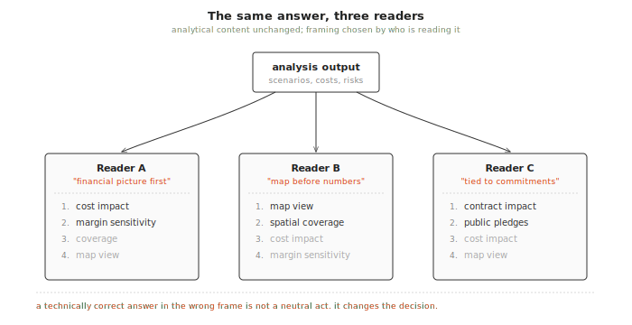
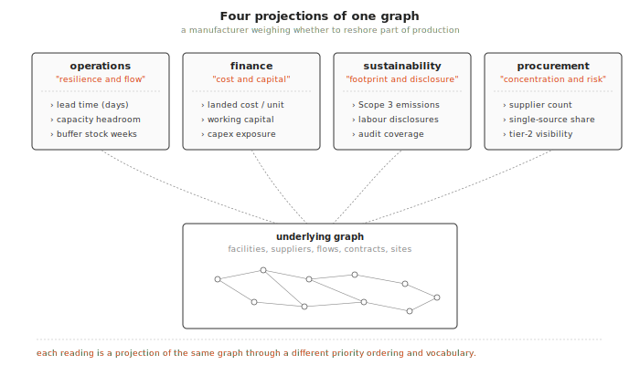
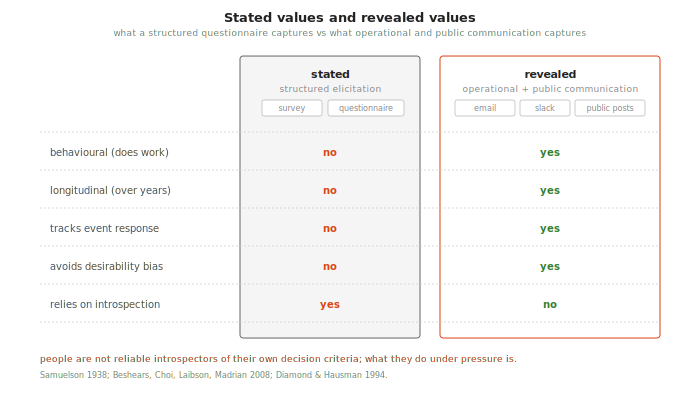
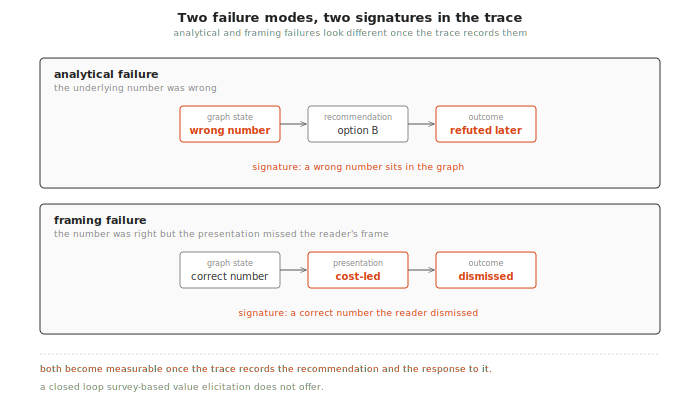
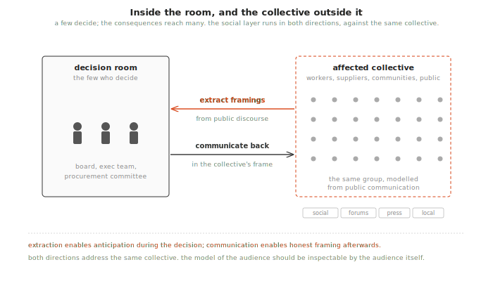
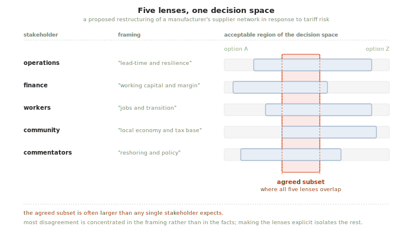

+++
title = "The social layer: modelling how decision-makers think about problems"
date = "2026-03-28"
draft = false
description = "Why decision support fails when it answers correctly in language the decision-maker does not use, and what an architecture that learns the framing from operational and public communication looks like."
+++

*The fourth post in the [When deliberation meets reality](/posts/when-deliberation-meets-reality/) essay series. The [previous post](/posts/why-no-single-model-will-save-us/) argued that AI value comes from specialised models at specific points in a stable infrastructure, orchestrated by a general-purpose facilitator. This post examines the layer that has been hardest to formalise: how the facilitator learns the framings of the people a decision will reach, whether they are the few who make it or the many it will land on.*

## Abstract

Decision support fails when it answers correctly in language the decision-maker does not use. Drawing on Tversky and Kahneman's work on framing effects and on twenty years of naturalistic decision-making research, this post argues that the gap between a system's framing and a decision-maker's framing is as costly as the gap between the question and the answer, and that framing belongs upstream of presentation, close to query dispatch. It introduces a social layer that sits above the technical architecture and represents how decision-makers actually frame problems, including the distinction between stated and revealed preferences, so that the same underlying analysis can resolve into different presentations for different readers without re-running the work. The layer is what turns an analytically correct system into one whose answers land.

Hypotheses introduced (one per section):

1. [Decision support fails when it answers correctly in language the decision-maker does not use. The gap between the system's framing and the decision-maker's framing is as costly as the gap between the question and the answer.](#the-framing-gap)
2. [Stakeholder framings are projections of a shared underlying graph. Making the projection explicit and learnable is more tractable than eliciting framings through structured exercises.](#framing-as-projection)
3. [Values inferred from operational and public communication track decision-relevant priorities more reliably than values reported in structured elicitation exercises.](#revealed-values-and-stated-values)
4. [If a decision-maker's framing is modelled, framing failures become a distinct and measurable category of error, separable from analytical failures in the trace.](#framing-failure-as-a-failure-mode)
5. [When a small number of decision-makers decide on behalf of a much larger affected population, the collective's framings can still be modelled from public communication and used to present the decision back in terms the collective understands.](#from-inside-the-room-to-the-collective-outside-it)
6. [Making different stakeholders' framings of the same situation explicit and inspectable contributes to collective understanding independently of any consensus mechanism.](#multi-stakeholder-coordination)

## The framing gap

*Hypothesis: decision support fails when it answers correctly in language the decision-maker does not use. The gap between the system's framing and the decision-maker's framing is as costly as the gap between the question and the answer.*

When I served as the human facilitator on supply chain and network planning engagements, I learned each client's framing over time. After a few sessions, I knew that one client wanted the financial picture before anything else, another would not engage with a recommendation until it was placed on a map, and a third would only take a result seriously once it was tied back to commitments they had already made publicly. The analytical content of what I presented was the same in all three cases. The framing was what made it land, and adjusting the framing was most of what the facilitator role actually consisted of.

This is consistent with the wider literature on how experts use decision aids under operational pressure. Tversky and Kahneman showed in 1981 that logically equivalent presentations of the same choice produce systematically different decisions, and the effect persists among domain experts when the stakes are real[^framing_effects]. The naturalistic decision-making (NDM) programme found that experts rely on pattern-matched mental models rather than structured comparison of options, and that decision aids which violate the expert's existing frame are typically discarded rather than corrected[^klein_ndm]. The lesson from twenty years of NDM research is that the frame is part of how the analysis is read, not scaffolding around it.

The implication for an architecture that wants to support faster decisions is that the framing is not a presentation-layer concern to be added after the analysis is done. It belongs further upstream, closer to query dispatch: the same underlying query should resolve into different presentations depending on who is reading the answer, and getting that resolution wrong wastes the analytical work that produced it.

## Framing as projection

*Hypothesis: stakeholder framings are projections of a shared underlying graph. Making the projection explicit and learnable is more tractable than eliciting framings through structured exercises.*

The domain ontology models the world as it is: entities, relationships, attributes, processes. A decision-maker's mental model operates on a different layer. Consider a manufacturer weighing whether to reshore part of its production in response to tariff and disruption risk. The operations director reads the question in terms of lead times, capacity, and buffer stock levels. The finance director reads the same question in terms of landed cost, working capital, and capex exposure. The sustainability lead reads it in terms of Scope 3 emissions and supplier labour disclosures. The procurement lead reads it in terms of supplier concentration and single-source risk. Each reading is a projection of the same underlying graph, filtered through a different priority ordering and expressed in different vocabulary[^mental_models]. The distinction between a domain ontology and a stakeholder's cognitive frame is rarely made explicit in the knowledge representation literature, but it matches the older distinction between formal ontology and conceptual modelling[^ontology_vs_frame].

Treating framings as projections rather than as opinions has a useful consequence. Projections can be composed with the underlying graph automatically, which means the same scenario comparison can be presented to the operations director in lead-time and capacity terms and to the finance director in landed-cost terms without re-running the analysis. The architecture already separates the query from its presentation. The social layer is the model that selects the presentation from a learned profile of the reader.

The technical precedent for learning these profiles from data is recent but converging across two bodies of work. Workplace communication corpora have been used to extract role-specific vocabulary, implicit preference structures, and stakeholder priority orderings, with results that exceed structured elicitation on the same populations[^workplace_nlp]. Public discourse corpora (social media posts, news comments, stakeholder submissions, forum threads) have been used to extract stance, argument structure, and expressed values on contested topics, with methods that are now mature enough to operate at the scale of a contested industrial decision[^public_discourse]. The methods are not exotic. Fine-tuned language models on labelled spans, stance and argumentation mining, topic models conditioned on speaker role, and entity-linking against a domain ontology cover most of what is needed. The novelty is in connecting the extracted framing back to a specific projection of a graph query, so that the presentation becomes a function of who is asking or who is being addressed.

## Revealed values and stated values

*Hypothesis: values inferred from operational and public communication track decision-relevant priorities more reliably than values reported in structured elicitation exercises.*

This is where the social layer connects to ARIA's Theme 3 in a way that surveys and deliberation platforms cannot. The divergence between stated and revealed preferences is one of the older findings in behavioural economics, going back to Samuelson's 1938 formulation of revealed preference theory and reaffirmed across decades of work on how poorly questionnaire responses predict behaviour under real conditions[^revealed_pref]. Survey-based value elicitation is subject to social desirability bias, framing effects in the survey instrument itself, and the basic difficulty that people are not reliable introspectors of their own decision criteria. None of this is news to the elicitation literature, but it does set a low ceiling on what a structured exercise can be expected to reveal about how a stakeholder will actually weigh trade-offs when the decision is in front of them.

Operational and public communication do better on two dimensions. Both are longitudinal, which means they capture how priorities shift in response to events such as a tier-two supplier failure that changes what resilience means to a procurement team, a port disruption that elevates contingency language in logistics discussions, or a public controversy that changes which labour and environmental terms people use to evaluate a sourcing decision. Both are also behavioural in the sense that the speaker is using the language to do work (coordinating, arguing, complaining, praising) rather than to report on themselves, which removes most of the introspection problem.

The two sources complement each other. Internal communication carries the framing of the people who will formally make the decision: operations, procurement, finance, sustainability leads, and the executives above them. Public communication carries the framing of everyone else the decision will reach: workers at affected facilities, customers, local communities, industry commentators, regulators in their public capacity, civil society groups. A full picture of how a proposed change will land needs both, because a decision framed correctly for the internal audience can still fail on contact with the public audience that speaks a different language about the same facts.

The ethical surface here needs to be named explicitly. Mining internal communication logs requires consent, clear boundaries on what is extracted (priority structures and vocabulary, not personal content), and transparency to the stakeholders whose framings are being modelled. Public discourse analysis raises a different set of concerns: the data is already public but aggregating it into a model of how a named community frames an issue can still cross lines around profiling and manipulation, particularly if the model is then used to optimise persuasion rather than to improve understanding. The architecture should make the extracted framing inspectable by the people it describes, individuals where possible and groups where not, so that the model of the audience can be corrected by the audience itself. This is the same inspectability principle that runs through the rest of the system, applied to the model of the user rather than the model of the world.

## Framing failure as a failure mode

*Hypothesis: if a decision-maker's framing is modelled, framing failures become a distinct and measurable category of error, separable from analytical failures in the trace.*

If the system models how decision-makers frame the answers they receive, it can predict where misunderstandings will occur. A worked example: the analysis recommends sourcing strategy B for a component line, the operations director rejects it, and the trace shows that the presentation emphasised landed cost savings while the director was optimising for lead-time resilience following a recent tier-two supplier failure. This is not an analytical failure, since the underlying numbers were right. It is a failure of the presentation to match the reader's frame, and once the trace records both the recommendation and the response to it, the failure becomes observable rather than inferred from later complaints.

Framing failures and analytical failures leave different signatures in the trace. An analytical failure leaves a wrong number in the graph, while a framing failure leaves a correct number that the decision-maker dismissed. Both kinds become visible if the trace is inspectable, which is the point of P1 in the architecture[^inspectability]. Once visible, the rate at which the AI facilitator produces framing failures becomes a benchmark for the social layer's quality, which is a closed loop that survey-based value elicitation does not offer.

## From inside the room to the collective outside it

*Hypothesis: when a small number of decision-makers decide on behalf of a much larger affected population, the collective's framings can still be modelled from public communication and used to present the decision back in terms the collective understands.*

Most operational decisions are made by a small number of people. A board approves a reshoring plan. An executive team decides to close a distribution centre in one region and open another elsewhere. A procurement committee changes a multi-year supplier relationship. In each case, the decision is made by a handful of people but the consequences reach workers, suppliers, customers, local economies, and a general public that will read about it in the trade press or on social media within days. The framings that matter therefore extend well beyond the people in the room.

This is the part of the social layer that turns outward. The same machinery that extracts a procurement director's framing from internal communication can, with different data sources and appropriate constraints, extract the framings that prevail in the relevant public discourse: how affected communities talk about factory closures, how trade journalists frame reshoring, how industry associations describe disruption, how civil society groups characterise supplier practices. These framings are latent in public text and can be recovered with the same stance and argumentation-mining methods already in use elsewhere in the natural language processing (NLP) literature[^public_discourse].

Having those framings in the architecture enables two things that are not currently possible in most corporate decision workflows. The first is anticipation during the decision itself: the executives in the room can see, while they are still deciding, how a given option will read in the language the affected collective actually uses, rather than in the language corporate communications will later try to impose. The second is honest communication after the decision: the same option, once chosen, can be presented back to the affected collective in the vocabulary and priority ordering that collective already uses, without the explanation having to pass through a translation layer designed primarily to reassure investors.

This is where the honest case has to be made about failure modes. The same mechanism that lets a decision be communicated back to a collective in its own language can be used to optimise persuasion without improving substance, which is closer to public relations than to collective understanding. The safeguard has to be structural rather than aspirational. The framings extracted from public discourse should be inspectable and correctable by the communities those framings claim to represent, and the trace of how a framing was used in a given communication should be visible to anyone who wants to audit it. Without that, the social layer becomes a sophisticated messaging operation. With it, the same capability becomes a means of closing the gap between how decisions are made and how they are understood by the people they affect.

## Multi-stakeholder coordination

*Hypothesis: making different stakeholders' framings of the same situation explicit and inspectable contributes to collective understanding independently of any consensus mechanism.*

Different stakeholders frame the same situation through different lenses. Take a proposed restructuring of a manufacturer's supplier network in response to tariff risk. The operations function may frame it as a lead-time and resilience problem. The finance function may frame it as a working-capital and margin problem. Affected workers and their representatives may frame it as a job-security and transition problem. Local communities near affected facilities may frame it as a local-economy and tax-base problem. Industry commentators may frame it as a reshoring and policy problem. These framings can be treated as projections of the same underlying graph, each privileging a different set of nodes, edges, and metrics, rather than as competing opinions to be averaged or arbitrated.

Making the projections explicit changes the structure of the disagreement. Instead of stating that the operations function and the affected community disagree about the proposal, the system can present the same data through all the relevant lenses, identify the metrics that diverge between lenses, and isolate the subset of the decision space where all the lenses agree. The agreed subset is often larger than any single stakeholder expects, because much of the disagreement is concentrated in the framing rather than in the facts. This kind of scaffolding emerges from the data rather than being imposed by a facilitator, and it aligns with the small but growing literature on computational support for value pluralism in multi-stakeholder planning[^value_pluralism].

This does not resolve the cases where the framings genuinely disagree about the facts, and no part of the architecture claims to. The contribution is more modest: separating the framing disagreements from the factual ones, so that the factual disagreements can be addressed on their merits rather than through a vocabulary fight.

## Research questions

Three questions are testable and would, between them, settle whether the social layer earns its place in the architecture.

The first is whether framing can be learned well enough from operational and public communication to meaningfully improve how the facilitator presents answers. Operationalised, this becomes a blind comparison test: do stakeholders prefer the framing-adapted output to the default output, and is the preference stable across decision contexts rather than driven by surface fluency. This is a relatively cheap experiment to run on existing deployments where the human facilitator's framing choices are already documented.

The second is whether framing-adapted presentation changes decision quality, or only decision-maker satisfaction. These are different outcomes and they can dissociate. A frame the decision-maker prefers may also be the one that obscures inconvenient trade-offs. If the social layer optimises for satisfaction, it can degrade decisions while improving the user experience. The honest test is whether decisions made through framing-adapted presentations are better on the decision-maker's own stated criteria when measured after the fact, rather than whether the presentations were better received in the moment.

The third is whether framings extracted from public discourse and used to communicate decisions back to an affected collective actually improve collective understanding, as opposed to merely improving reception. Understanding and reception can dissociate in the same way that decision quality and decision-maker satisfaction can dissociate, and for the same underlying reason. The test has to measure whether the affected population's assessment of the decision's trade-offs becomes more accurate after framing-adapted communication, not whether the communication generates less complaint.

The second and third questions are the harder ones and the more important. They are also where the work on the social layer becomes a research question about whether modelling cognition contributes to collective intelligence or amounts to a sophisticated form of telling people what they want to hear. The architecture is built to make that distinction visible in the trace. Whether the distinction holds up under empirical pressure is an open question, and it belongs in the [hypothesis register](/builds/lga-architecture/hypothesis-register/) alongside the others.

[^framing_effects]: Tversky, A. & Kahneman, D. (1981). [The Framing of Decisions and the Psychology of Choice](https://doi.org/10.1126/science.7455683). *Science*, 211(4481), 453-458. The original demonstration that logically equivalent presentations of the same choice produce systematically different decisions. For evidence that framing effects persist among domain experts under operational conditions, see McNeil, B.J., Pauker, S.G., Sox, H.C. & Tversky, A. (1982). [On the Elicitation of Preferences for Alternative Therapies](https://doi.org/10.1056/NEJM198205273062103). *New England Journal of Medicine*, 306(21), 1259-1262.

[^klein_ndm]: Klein, G. (1998). *Sources of Power: How People Make Decisions*. MIT Press. The naturalistic decision-making programme documents how domain experts under time pressure rely on recognition-primed decision-making rather than structured comparison of options, and why decision aids that violate the expert's existing frame are typically rejected. For a recent assessment of how this finding generalises to AI-augmented decision support, see Lyell, D. & Coiera, E. (2017). [Automation Bias and Verification Complexity: A Systematic Review](https://doi.org/10.1093/jamia/ocw105). *Journal of the American Medical Informatics Association*, 24(2), 423-431.

[^mental_models]: The mental models tradition in cognitive science treats decision-makers as operating on internal representations that are structurally simpler than the underlying domain but selected for the tasks the decision-maker actually performs. See Johnson-Laird, P.N. (1983). *Mental Models: Towards a Cognitive Science of Language, Inference, and Consciousness*. Harvard University Press. For a more recent synthesis applied to expert decision-making in operational settings, see Klein, G. (2008). [Naturalistic Decision Making](https://doi.org/10.1518/001872008X288385). *Human Factors*, 50(3), 456-460.

[^ontology_vs_frame]: The distinction between a domain ontology (a formal model of the entities and relationships in a problem domain) and a stakeholder's cognitive frame (the projection of that domain through their priorities and vocabulary) is rarely made explicit in the knowledge representation literature, but it matches the distinction Guarino draws between formal ontology and conceptual modelling. See Guarino, N. (1998). Formal Ontology in Information Systems. In *Proceedings of FOIS '98*, IOS Press, 3-15. The architectural consequence is that the ontology should be shared across stakeholders while the projections are stakeholder-specific.

[^workplace_nlp]: For the use of workplace communication corpora to extract preference structures and role-specific vocabulary, see the Enron corpus literature, beginning with Klimt, B. & Yang, Y. (2004). [The Enron Corpus: A New Dataset for Email Classification Research](https://doi.org/10.1007/978-3-540-30115-8_22). *European Conference on Machine Learning*. More recent work using transformer-based models to infer organisational priorities from internal communication includes Card, D., Tan, C. & Smith, N.A. (2018). [Neural Models for Documents with Metadata](https://aclanthology.org/P18-1189/). *Proceedings of ACL*. The methods generalise to messaging logs once consent and entity-linking against a domain ontology are in place.

[^public_discourse]: For methods to extract stance, argument structure, and expressed values from public discourse, see Mohammad, S.M., Sobhani, P. & Kiritchenko, S. (2017). [Stance and Sentiment in Tweets](https://doi.org/10.1145/3003433). *ACM Transactions on Internet Technology*, 17(3), 1-23. For argumentation mining in user-generated web content, see Habernal, I. & Gurevych, I. (2017). [Argumentation Mining in User-Generated Web Discourse](https://doi.org/10.1162/COLI_a_00276). *Computational Linguistics*, 43(1), 125-179. These methods have been applied to contested topics in political and consumer domains and are applicable with minor adaptation to industrial decisions that attract public attention.

[^revealed_pref]: Samuelson, P.A. (1938). [A Note on the Pure Theory of Consumer's Behaviour](https://doi.org/10.2307/2548836). *Economica*, 5(17), 61-71. The original formulation of revealed preference theory. For the divergence between stated and revealed preferences in survey-based value elicitation, see Beshears, J., Choi, J.J., Laibson, D. & Madrian, B.C. (2008). [How Are Preferences Revealed?](https://doi.org/10.1016/j.jpubeco.2008.04.010) *Journal of Public Economics*, 92(8-9), 1787-1794. For the specific case of stated versus revealed environmental and sustainability preferences, which is directly relevant to ARIA's Theme 3, see Diamond, P.A. & Hausman, J.A. (1994). [Contingent Valuation: Is Some Number Better than No Number?](https://doi.org/10.1257/jep.8.4.45) *Journal of Economic Perspectives*, 8(4), 45-64.

[^inspectability]: P1 (every decision leaves an inspectable trace) is the first of the nine governing principles documented in the architecture specification. The framing failure case is a specific instance of why traces matter beyond technical debugging: they make a category of failure visible that would otherwise be invisible to both the decision-maker and the system. See the [Core Principles and Architectural Decisions reference document](/builds/critical-thinking-infrastructure/) for the full set of principles.

[^value_pluralism]: For computational support for value pluralism in multi-stakeholder planning, see Sen, A. (2002). *Rationality and Freedom*. Harvard University Press, on the formal status of multiple irreducible value lenses. For a recent computational instantiation, see Gabriel, I. (2020). [Artificial Intelligence, Values, and Alignment](https://doi.org/10.1007/s11023-020-09539-2). *Minds and Machines*, 30, 411-437, which surveys approaches to representing plural values in AI systems without collapsing them to a single utility function.