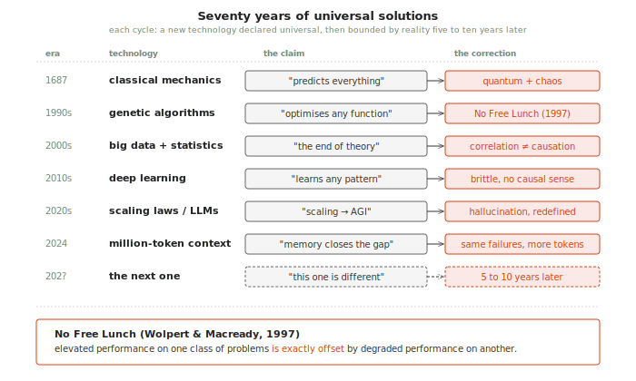
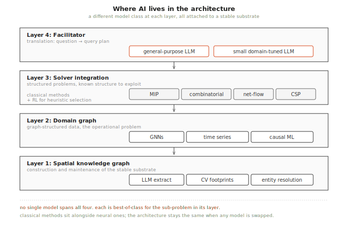
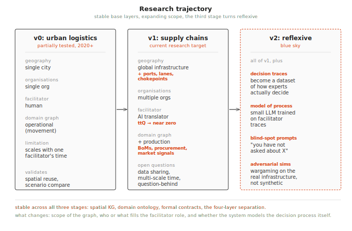

+++
title = "No single model will save us"
date = "2026-03-25"
+++

*A continuation of [When Deliberation Meets Reality](https://elias-jw.github.io/posts/when-deliberation-meets-reality/) and [Building Critical Thinking Infrastructure](https://elias-jw.github.io/posts/building-critical-thinking-infrastructure/), which together argued that the missing precondition for collective flourishing is critical thinking infrastructure fast enough to survive contact with reality. This post, Part 3 of the [Critical thinking infrastructure essay series](/posts/critical-thinking-infrastructure-series/), addresses where AI actually lives in that architecture, why no single model can take its place, and where the architecture goes next.*

## Abstract

The instinct in 2026 is to reach for one large language model and ask it to do everything. This post argues, from Wolpert and Macready's no free lunch theorems and from seventy years of overpromise and correction in computational optimisation, that no single model outperforms all others across all problem instances, and that the right response is to invest in a stable substrate with pluggable specialised models rather than to chase a god-model. It then works through where AI actually lives in the four-layer architecture: extraction and entity resolution at the spatial layer, graph neural networks and causal models at the domain layer, classical mathematical solvers at the compute layer, and a general-purpose LLM as the facilitator that translates questions into compositions of the above. The platform is the infrastructure; the models are replaceable.

Hypotheses introduced (one per section):

1. [No single model or technology outperforms all others across all problem instances.](#no-free-lunch)
2. [The value of AI in decision support comes from specialised models operating at specific points in a stable infrastructure, orchestrated by a general-purpose facilitator. The infrastructure is the platform; the models are pluggable.](#where-ai-lives-in-this-architecture)
3. [The architecture evolves through three stages, each extending the scope of the system while preserving the stable base layers. The third stage is where the system begins to model decision-making itself.](#the-research-trajectory-from-logistics-to-collective-intelligence)

## Introduction

The [previous post](https://elias-jw.github.io/posts/building-critical-thinking-infrastructure/) proposed a four-layer architecture (spatial knowledge graph, domain graph, solver integration, micro-tools) with a facilitator role that compresses ttQ and ttA inside the decision window. It closed by flagging that the facilitator role, currently performed by a human translating decision-makers' questions into queries against the graph, is the next place where compression has to happen. It also flagged a separate concern that needed its own treatment: why no single model will save us. This post takes up both threads, because they turn out to be the same. The facilitator question and the god-model question are answered together by working out which model belongs at which point in the architecture, and why the architecture itself is the thing that has to remain stable while the models attached to it change.

## No free lunch

*Hypothesis: no single model or technology outperforms all others across all problem instances.*

The instinct in 2026 is to reach for a single large language model and ask it to do everything. Translate the question, query the data, run the analysis, summarise the result, defend the recommendation. The architecture in the previous post looks elaborate by comparison, with its stable spatial foundation, declarative ontology, formal contracts between layers, and specialised solvers behind disciplined adapters. A reasonable reader, especially one who watched LLMs collapse time-to-answer across a dozen white-collar tasks in two years, might wonder whether all those layers are doing real work or whether they are over-engineering in a field that the model layer is about to absorb.

The same question has been asked of the field, in slightly different forms, for the better part of seventy years, and the answer has been the same every time. A new technology arrives, demonstrates impressive results on a class of problems, and is promptly declared the universal solution. Newton's mechanics was going to predict everything until quantum phenomena and chaotic systems showed where its reach ended. Genetic algorithms were going to optimise any function, until they ran headlong into Wolpert and Macready's No Free Lunch theorems in 1997. The theorems proved formally that any algorithm's elevated performance on one class of problems is exactly offset by degraded performance on another[^nfl]. Big data and statistical inference were going to render theory obsolete, then deep learning was going to learn any pattern until it turned out to be brittle to adversarial perturbations and unable to reason about causal structure.

Large language models were going to scale their way to general intelligence, with the scaling laws read as a straight line from more parameters and more data to AGI. When the curve started to bend, the story shifted to context windows, on the argument that a model with a million tokens of working memory would close whatever gap remained. When that did not deliver either, the definition of AGI itself began to drift, quietly redefined from "human-level general intelligence" to whichever economic or benchmark threshold the next model release happened to clear. Each cycle of overpromise and correction takes roughly five to ten years, and each one ends with the same realisation that the technology is excellent at the things it is excellent at and unreliable at the things it is not.

The relevance to critical thinking infrastructure is direct. A facility location problem with discrete coverage trade-offs is a combinatorial optimisation problem, not a language problem, and asking an LLM to solve it directly produces fluent output that is often wrong in ways the decision-maker cannot detect from the answer alone. A causal question about supply chain propagation is not a pattern-matching problem, and a model trained on text correlations will reproduce the correlations without distinguishing them from causes. A spatial overlay between a regulatory zone and a building dataset is not a reasoning task in the sense LLMs are good at, and a model trying to answer it from parametric memory will invent buildings, boundaries, or both. The first post argued that the binding constraint on decision quality is speed, and the second showed how to compress that speed without sacrificing rigour. A god-model strategy collapses both arguments, because it produces fast answers by giving up the grounding that made the speed worth having in the first place. Speed without traceable evidence is just gut instinct in a more articulate voice.

The architecture in the previous post takes the opposite position. The stable base layers are technology-agnostic infrastructure, while the models attached at each point are chosen for their fit to a specific sub-problem and designed to be swapped when something better arrives. There is a counter argument that LLMs can actually write code that can solve all the above, and it is a good one. It also fits well within the architecture on the micro-tools layer. This is not a philosophical commitment to eclecticism so much as an engineering response to a mathematical fact: any elevated performance on one class of problems comes at a cost on another, so the sensible move is to invest in the substrate that lets you match the right tool to each sub-problem rather than searching for the one tool that handles everything. The rest of this post works through what that looks like layer by layer, and then traces where the architecture goes next.

## Where AI lives in this architecture

*Hypothesis: the value of AI in decision support comes from specialised models operating at specific points in a stable infrastructure, orchestrated by a general-purpose facilitator. The infrastructure is the platform; the models are pluggable.*

The current discourse treats AI as a monolithic capability, where you have "an AI" and it does things. This framing inherits the god-model assumption, but in practice the architecture requires different AI capabilities at different layers, each with different characteristics and each serving a different part of the planning problem. We do note that LLMs do not have to be applied at every layer. Still, as a new and promising technology, it is worth speculating on where and how LLMs, and more established fields of AI, may prove useful.

**At the spatial knowledge graph layer,** the tasks are construction and maintenance. Large language models can extract entity relationships from unstructured text by parsing shipping manifests, news articles, regulatory filings, and corporate disclosures to populate the graph with supplier-to-manufacturer relationships that no single database contains[^llm_kg]. Computer vision models extract building footprints from satellite imagery to fill gaps in crowdsourced mapping data, and spatial entity resolution models, specialised for multilingual address matching and proximity scoring, determine that two records in different databases refer to the same real-world building. These are narrow, well-defined tasks where domain-specific models outperform general-purpose ones by a comfortable margin.

**At the domain graph layer,** graph neural networks become relevant. GNNs can perform link prediction on supply chain networks, inferring hidden relationships between firms that are not directly observable in public data[^kosasih_gnn], and they can detect anomalous patterns in temporal graphs to flag potential bullwhip amplification or supply chain contagion before it cascades. Time series models handle demand forecasting, while causal inference models distinguish correlation from genuine propagation mechanisms in disruption scenarios[^causal_ml]. Each of these is a specialised model trained on graph-structured data, operating within the domain ontology rather than outside it.

**At the solver integration layer,** the models are not neural at all. Facility location uses mixed-integer programming, coverage and set-cover problems use combinatorial optimisation, network flow problems use min-cost flow algorithms, and resource allocation under hard constraints uses constraint programming. These are mature, well-understood methods that outperform learned approaches on their specific problem classes because the problem structure is known and exploitable. Replacing a mixed-integer solver with a neural network would be a god-model move that trades decades of problem-specific engineering for a general-purpose approximator that is slower and less reliable on this class of problem[^classical_solvers]. Reinforcement learning has a role here in adaptive heuristic selection, learning which solver configuration works best for which sub-problem, but the solvers themselves remain classical.

**At the facilitator layer,** the general-purpose LLM earns its place. The facilitator's job is translation, converting a decision-maker's natural language question into a composition of graph queries, solver invocations, and micro-tool calls, which requires broad language understanding, domain awareness loaded from the ontology, and the ability to decompose a vague question into precise sub-queries. A general-purpose LLM orchestrating specialised tools is the right architecture at this layer, for the same reason that a human facilitator with broad knowledge and access to specialised tools tends to outperform either a specialist without breadth or a generalist without tools.

The critical design decision is what sits between the general-purpose facilitator and the specialised models, because this is where small, domain-specific LLMs become interesting. A model fine-tuned on the domain ontology, on the patterns of graph queries that answer common planning questions, and on the mapping between natural language and formal graph operations can translate faster and more reliably than a general-purpose model reasoning from first principles each time, and it can also be tested, validated, and version-controlled against the ontology it serves in a way that a general-purpose model cannot.

The open research question is where the boundary between these two sits. Which translation tasks benefit from domain-specific fine-tuning, and which are better handled by a general-purpose model with the right context? The answer is almost certainly "both, at different points," which is exactly what the No Free Lunch theorem predicts, and the architecture is designed to make that boundary traversable so that a task can start with the general-purpose facilitator and migrate to a specialised model as usage patterns emerge and training data accumulates. This is P8 (materialisation is an economic decision) applied to AI itself[^p8].

## The research trajectory: from logistics to collective intelligence

*Hypothesis: the architecture evolves through three stages, each extending the scope of the system while preserving the stable base layers. The third stage is where the system begins to model decision-making itself.*

**v0: Urban logistics (partially tested, 2020 onwards).** The current setup focuses on a single city, single organisation, and single human facilitator. The spatial knowledge graph covers one geography, the domain graph represents one organisation's operational problem, and the facilitator is a person who knows both the system and the client's domain. This is where the core concepts will be validated, showing that pre-built spatial foundations compress project setup, that scenario comparison changes how planners think, and that the iteration rate determines decision quality. The limitation is that it scales with the facilitator's availability, so any given facilitator can only serve one client at a time.

**v1: Supply chains and global logistics (current research target).** The next setup will enable multiple cities, multiple organisations, and AI facilitators. The spatial graph extends to global infrastructure including ports, shipping lanes, chokepoints, and trade corridors, while the domain graph extends upstream from movement (logistics) to production (supply chains), covering bills of materials, procurement relationships, and market signals. The AI facilitator replaces the human facilitator for routine questions, compressing ttQ toward zero, and shipping is the obvious proving ground because the Suez blockage, Red Sea disruptions, tariff-driven sourcing shifts, and container imbalance are all graph problems that the architecture is designed for[^shipping]. The research questions here concern data sharing (firms will not share competitive information), multi-scale temporal reasoning (hourly market signals alongside yearly product architectures), and whether the AI facilitator can match the human facilitator's ability to ask the question behind the question.

**v2: Decision simulation and collective intelligence (blue sky).** This is where the architecture turns reflexive. If every decision made through the system produces an inspectable trace ([as the first post argued](https://elias-jw.github.io/posts/when-deliberation-meets-reality/)), then after enough decisions the system accumulates a dataset of how decision-makers actually use analytical tools, including which questions they ask first, which scenarios they compare, what trade-offs they accept, and where they override the model's recommendation and why. That dataset enables a different kind of model, one trained not on the domain but on the decision process itself.

A small LLM trained on facilitator traces can learn the patterns of expert questioning, anticipating what a planner will ask next based on what planners in similar situations have asked before, and more usefully it can identify blind spots in the form of questions that should be asked but are not. An example might be a prompt such as "you have not asked about supplier concentration risk in the eastern corridor, but the graph shows 80% of your tier-2 suppliers depend on the same port." The role of the system shifts gradually from answering questions to helping generate them, with the decision-maker still in charge but working against a tool that pushes back on omissions rather than only responding to prompts.

The same capability opens the door to adversarial modelling. If you can model how a decision-maker uses the tool, you can model how a competitor or adversary would respond to the same information, which lets you ask questions like "if we shift sourcing away from supplier X, what is the most likely competitive response from firms Y and Z, and how does that move the price floor over the next two quarters?" This is wargaming conducted on the actual decision infrastructure rather than on a simplified simulation built separately for the purpose, and the traces feeding it are real operational decisions rather than synthetic scenarios.

At the collective level, v2 opens the possibility of federated intelligence, where multiple organisations run the same architecture on their own data with shared public base layers (the spatial knowledge graph) and private domain layers (their own supply chain data). No organisation shares raw data, and instead they share aggregated patterns such as "demand for container shipping from Southeast Asia to Northern Europe has increased 15% this month." The spatial knowledge graph becomes public infrastructure in the same sense that weather services or financial market data are public, while the domain-specific insights remain private, and the collective benefits from shared situational awareness without requiring any single organisation to reveal competitive information.

The step from v1 to v2 is the point at which the system stops being a decision support platform and becomes a research instrument for studying collective decision-making. If the traces are available with appropriate consent and anonymisation, researchers can ask questions that are currently very hard to answer empirically, including how decision-makers under pressure actually use analytical tools, what the relationship is between iteration speed and decision quality in real-world settings, and whether inspectability changes behaviour or whether people mostly ignore the trace. These are empirical questions about human cognition and collective coordination, and the architecture allows them to be studied through the lens of actual operational decisions rather than through laboratory experiments on undergraduates solving toy problems.

That is the connection to ARIA's Collective Flourishing programme. The architecture is infrastructure for studying collective flourishing empirically, using supply chains as the laboratory and decision traces as the data.

The next post in this series turns to the institutional question this trajectory raises but does not answer: who builds and maintains the public substrate that the architecture depends on, and why it has to exist as public infrastructure rather than as anyone's product.

[^nfl]: Wolpert, D.H. and Macready, W.G. (1997) 'No Free Lunch Theorems for Optimization', *IEEE Transactions on Evolutionary Computation*, 1(1), pp. 67–82. Available at: <https://doi.org/10.1109/4235.585893>.
    *Note:* For an accessible explanation of the theorem and a discussion of its implications for modern machine learning, see Ho, Y.C. and Pepyne, D.L. (2002) 'Simple Explanation of the No-Free-Lunch Theorem and Its Implications', *Journal of Optimization Theory and Applications*, 115(3), pp. 549–570. Available at: <https://doi.org/10.1023/A:1021251113462>.

[^llm_kg]: AlMahri, S., Xu, L. and Brintrup, A. (2025) 'Enhancing supply chain visibility with knowledge graphs and large language models', *International Journal of Production Research*, pp. 2178–2209. Available at: <https://doi.org/10.1080/00207543.2025.2575841>.
    *Note:* The framework uses zero-shot LLM prompting for named entity recognition and relation extraction over public sources, validated on electric vehicle battery supply chains and demonstrated to extend visibility beyond tier-2 suppliers without requiring direct information sharing between stakeholders. The earlier arXiv preprint is also available at <https://arxiv.org/abs/2408.07705>.

[^kosasih_gnn]: Kosasih, E.E., Margaroli, F., Gelli, S., Aziz, A., Wildgoose, N. and Brintrup, A. (2024) 'Towards knowledge graph reasoning for supply chain risk management using graph neural networks', *International Journal of Production Research*, 62(15), pp. 5596–5612. Available at: <https://doi.org/10.1080/00207543.2022.2100841>.
    *Note:* The same paper is referenced in the previous post on the role of ontologies in supply chain knowledge graphs. The authors demonstrate that graph neural networks trained on partial supply chain data can infer plausible hidden relationships between firms, addressing the structural problem that no single database has full visibility beyond tier 1.

[^causal_ml]: Wyrembek, M., Baryannis, G. and Brintrup, A. (2025) 'Causal machine learning for supply chain risk prediction and intervention planning', *International Journal of Production Research*, 63(15), pp. 5629–5648. Available at: <https://doi.org/10.1080/00207543.2025.2458121>.
    *Note:* The paper applies directed acyclic graphs and counterfactual reasoning to supplier intervention planning, demonstrated on a maritime engineering case study. It also makes the broader argument that black-box machine learning models are insufficient for supply chain risk management because managers are held accountable for outcomes and need to understand the causal mechanisms behind a recommendation before acting on it.

[^classical_solvers]: Da Ros, F., Soprano, M., Di Gaspero, L. and Roitero, K. (2025) 'Large Language Models for Combinatorial Optimization: A Systematic Review', *ACM Computing Surveys*. Available at: <https://doi.org/10.1145/3801961>.
    *Note:* The review synthesises 103 studies and finds that classical solvers continue to outperform learned approaches on well-structured combinatorial problems, while LLMs show their most promise in problem formulation, heuristic generation, and algorithm selection rather than in direct solving. The arXiv preprint is available at <https://arxiv.org/abs/2507.03637>.

[^p8]: P8 (materialisation is an economic decision, not a structural one) is the eighth governing principles from the [Core Principles and Architectural Decisions reference document](/builds/critical-thinking-infrastructure/). The principle states that the position of any computation on the spectrum from ephemeral micro-tool to permanent infrastructure should be determined by observed reuse relative to compute cost, not by design-time classification. Applied to AI, it means that a translation task should start at the general-purpose facilitator and migrate to a fine-tuned specialised model only when usage data justifies the materialisation.

[^shipping]: The current shipping disruption landscape provides an unusually rich test environment. Houthi attacks in the Red Sea caused a roughly 75% collapse in container shipments through the corridor, US tariff policy is driving real-time sourcing and inventory decisions, and container spot rates remain volatile. Each of these is a graph problem in the form of supplier exposure analysis, multi-modal capacity reallocation, or temporal scenario comparison under uncertainty.
    *Note:* For a recent treatment of how supply chain network structure transmits financial and operational shocks at scale, see Fialkowski, J., Diem, C., Borsos, A. and Thurner, S. (2025) 'A data-driven econo-financial stress-testing framework to estimate the effect of supply chain networks on financial systemic risk', arXiv preprint, arXiv:2502.17044. Available at: <https://arxiv.org/abs/2502.17044>.
