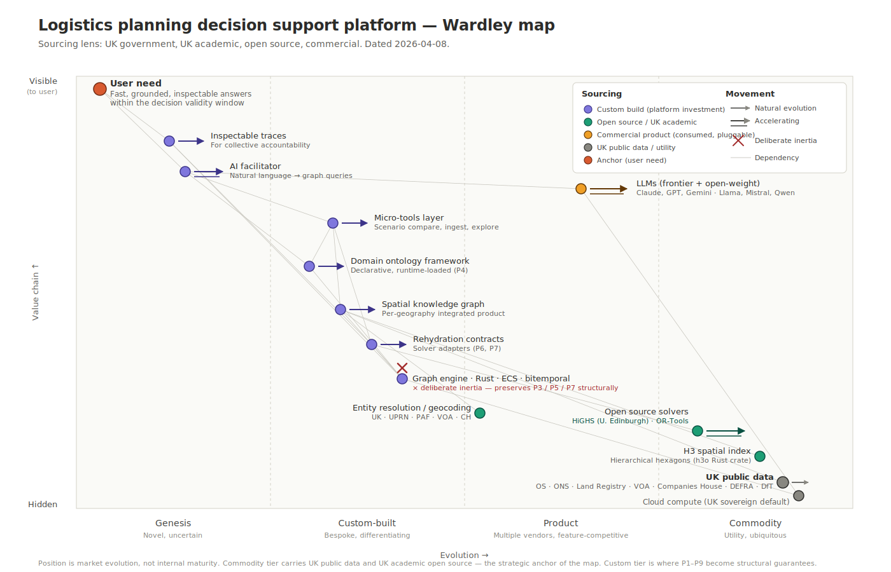
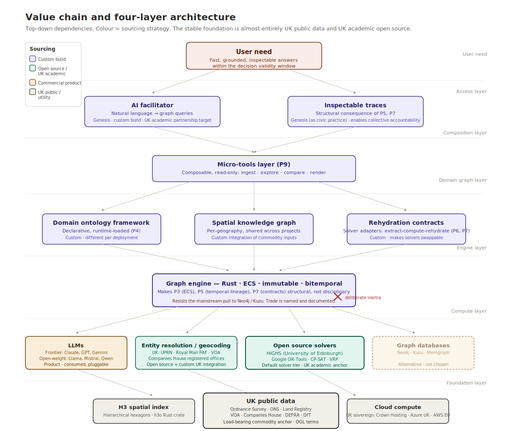
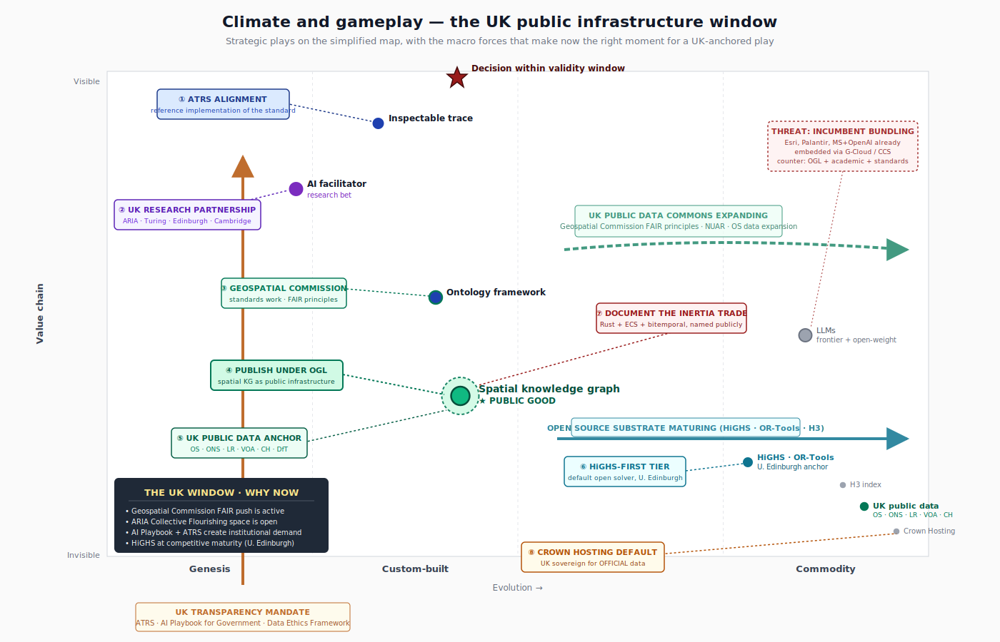
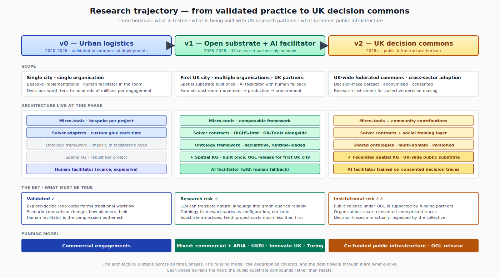

+++
title = "Mapping the UK public good case: a Wardley analysis of the architecture"
date = "2026-04-09"
draft = false
description = "A technical accompaniment to the essay series. Where the components of the platform sit on the evolution axis from genesis to commodity, what is moving, what is deliberately held in place, and what the UK public data and open source landscape make possible."
+++

*A technical accompaniment to the [Deliberation Meets Reality](/posts/when-deliberation-meets-reality/) series, in which we analyse and position the platform as a UK-public good initiative.*

## Abstract

A Wardley mapping exercise that positions the fifteen components of the platform on the evolution axis from genesis to commodity, and reads the resulting landscape for a UK public infrastructure play. The map's load-bearing commodity anchor is the UK public data commons (Ordnance Survey, ONS, Land Registry, Companies House, NUAR, and the FAIR data work of the Geospatial Commission), and its deliberate inertia sits on the Rust graph engine, which is held in place because the architectural principles it enforces are antibodies against failure modes observed repeatedly in production logistics systems. The post names the three climatic forces acting on the landscape, the seven strategic plays available in response, and the events that would force a revision of the map. The argument: grounded, inspectable decision support for physical operations is an under-provided public good, and the UK has the public data and academic open-source anchors to build it without importing a commercial stack.

## Introduction

The four main posts argued the case for critical thinking infrastructure that operates fast enough to survive contact with reality[^essay1], described what that infrastructure looks like[^essay2], examined why no single model can replace it[^essay3], and worked through the social layer that decides whether the system's answers actually land with the people who read them[^essay4]. This post takes a different cut. Rather than building the argument from first principles, it uses Simon Wardley's mapping technique[^wardley_book] to position the components of the platform on the evolution axis from genesis to commodity, asks what is moving and what is deliberately held in place, and works through what the UK public data and open source ecosystem make possible that a more conventional analysis would miss.

## Why a map at all

Strategy in technology businesses tends to be discussed in narrative form. Decks describe a vision, position the work against a market, and propose actions. The trouble with the narrative form is that it permits two different people to read the same document and walk away with two incompatible views of where the business is. A Wardley map is a constraint on that ambiguity. It forces the strategist to commit each component to a position on two axes, to draw the dependencies between them explicitly, and to mark which components are evolving and which are not. Once those commitments are on the page, disagreements become productive in a way they cannot be in prose, because the disagreement is now about a specific position rather than about a vague intuition.

The map serves a second purpose that matters more for a programme like this one. Wardley's framework is grounded in the observation that components evolve through four stages from genesis to commodity, that the right sourcing strategy at each stage is different, and that the most common strategic mistake is to treat a component as if it were at a different stage than the market actually places it. A custom-built component that the market has commoditised is a recurring expense without a corresponding advantage. A commodity component that an organisation tries to differentiate on is wasted effort. The map's value is that it makes these mismatches visible before they become embedded in a roadmap.

The platform described in the previous posts has fifteen components worth placing on a map. Some are distinctive custom work that the platform has to invest in to earn its differentiation. Some are open source assets that have crossed the threshold into reliable commodity. Some are commercial products that the platform consumes through stable interfaces. The interesting cases sit at the boundaries. A few are commodities that the platform leans on heavily because the UK public sector has produced and maintained them at public expense. One is a custom build that the architecture deliberately resists commoditising, even though the commodity alternative exists, because the correctness properties the custom version provides are load-bearing for the rest of the design. Naming these placements honestly, with the costs and trades they represent, is what the map is for.

## The user need and what sits below it

The anchor at the top of the map is the same compound user need that the first essay in the series argued for. A decision-maker under operational time pressure, with strategic consequences, requires answers that are fast enough to fit inside the decision validity window, grounded in evidence that can be inspected after the fact, and traceable in a form that the affected collective can engage with. Each of the three properties matters separately. Speed without grounding is gut instinct in a more articulate voice, which is the diagnosis the third essay applied to ungrounded large language models[^essay3]. Grounding without speed is the slow analytical workflow that the first essay argued is universally abandoned under pressure[^essay1]. Inspectability without either of the first two is enlightenment that arrives after the decision has already been made.

The compound user need sits at the top of the value chain because the platform exists to serve it, and because every component below should be evaluated by what it contributes to that compound rather than by its own internal elegance. A graph engine that is theoretically beautiful but slows down ttQ has failed by the standard the user actually applies. A solver that produces a perfect answer four hours after the decision was needed has produced a perfect answer to a question that is no longer being asked. The discipline that the user need imposes on the rest of the map is to keep asking, of every component, whether it contributes to that compound or whether it contributes to something else that only the platform's engineers care about.

There is a secondary user that matters here and that the map should make explicit. The collective who will live with the decisions has its own claim on the platform, mediated by the inspectable trace. The collective does not need to be present at the moment of decision, but it does need access to the reasoning afterwards in a form that supports learning, accountability, and course correction. Treating the collective as a secondary anchor on the map keeps the inspectability work from being treated as a nice-to-have, because losing it would mean the platform serves the decision-maker but not the people the decisions affect.

## The components on the map

The map shows fifteen components arranged across the four evolution stages, coloured by sourcing strategy. Custom build appears in purple, open source and UK academic work in teal, commercial product in amber, and UK public data and utility infrastructure in gray. The compound user need sits at the top in coral as the anchor.

The genesis end of the map carries two components that look small in the diagram and are the most consequential to the platform's research case. The AI facilitator is the first. It translates a decision-maker's natural language question into a composition of graph queries, solver invocations, and micro-tool calls, against a loaded domain ontology. A human facilitator has been doing this in commercial deployments since 2020, and the second essay in the series described what that role actually looks like in practice. The research question is whether a large language model with the ontology in context, supplemented by fine-tuning on facilitator traces, can match a human on the question-behind-the-question judgment that experienced facilitators apply when they translate "what happens if we lose that depot" into a precise scenario specification. The component is genesis-stage because the deployed examples are rare and the reliability question is open. It carries a high differentiation pressure score because it is visible to the user and not yet commoditised, which is the quantitative way of saying that the platform must invest here if it wants to differentiate.

The second genesis component is the inspectable trace as civic practice. Technically the trace is a structural consequence of two of the architecture principles that the third essay's footnotes referenced[^essay2]. The graph is immutable in the sense that state changes produce new nodes linked to old ones rather than overwriting previous state. Compute output that enters the graph must conform to a rehydration contract that names its inputs, outputs, idempotency guarantees, and scope. These two properties together mean the trace exists whether anyone reads it or not. What is genesis is the institutional practice of collective inspection. Open data portals exist and are underused. Freedom of Information requests exist and are filed by a tiny minority of citizens. The sociological question of whether traces actually get inspected, by whom, and under what conditions, is open in a way that the technical question is not, and the hypothesis register associated with the series flagged this as one of the seven open questions for self-critique[^essay1].

The custom-built tier is where the platform earns its differentiation and where most of its development effort lives. The micro-tools layer is the cheapest part of this tier, consisting of read-only composable tools that handle the work specific to a particular question. They are deliberately easy to build and easy to discard, and the architecture's promotion mechanism means that a micro-tool which proves useful across many projects can be moved to a more permanent layer once the reuse is observed. The domain ontology framework is the load-bearing part of this tier. It is a declarative configuration loaded at runtime that defines what node and edge types are meaningful for a deployment. Different deployments load different ontologies. The framework itself is custom, but each ontology is authoring work rather than engineering work, which is what allows the same engine to serve very different problem domains without code changes.

The spatial knowledge graph as an integrated product sits in the same tier and represents the largest single investment. The inputs to the spatial knowledge graph are commodity (UK public data, OpenStreetMap, H3 indexing, mature open source geocoders), but the integration of those inputs into a coherent graph for a geography is custom work. The economic argument for this investment is that the second project in a geography costs a fraction of the first, and the tenth costs almost nothing to set up. The strategic argument is that the spatial knowledge graph is the artefact that other components depend on, which makes it the natural place to anchor a public infrastructure play.

The rehydration contracts and solver adapters tier formalises the extract-compute-rehydrate pattern that the third essay referenced[^essay2]. The pattern itself is a textbook application of design-by-contract principles[^meyer_dbc] applied to the boundary between the graph and the analytical methods that consume and write to it, but the specific application to a bitemporal graph with an immutability guarantee is custom work that has to be done once and reused across solvers.

At the bottom of the custom tier sits the graph engine, written in Rust, using an entity-component-system pattern, with immutability and bitemporality built into the type system rather than enforced by convention. The map marks this component with a deliberate inertia symbol, and the symbol is meant to be honest rather than apologetic. The mainstream gravitational pull in this space is toward Neo4j, Kuzu, Memgraph, or a Postgres-with-JSONB hybrid. Any of those alternatives would lower the cost of recruiting graph database developers, would carry less ecosystem risk, and would fit more easily into the public sector procurement frameworks that already have approved suppliers in the graph database space. The reason to resist that pull is that the ECS prohibition on logic in components, the immutability rule against in-place mutation, and the contract requirement on writes to the graph are antibodies against three specific failure modes that have been observed repeatedly in logistics systems built on object-relational mappers and conventional graph engines. A mainstream graph database with disciplined developers can in principle honour all three properties. The custom engine makes them structural rather than disciplinary, and the architecture argues that the difference matters because discipline degrades over time and structure does not.

The product tier carries the components that the platform consumes rather than builds. Large language models, both frontier and open-weight, sit here. The third essay's argument that no single model can replace the architecture is the reason these components are in the product tier rather than in the custom tier. The platform uses LLMs through stable APIs, treats them as a swappable dependency, and benefits from every frontier improvement without absorbing any training cost. Open-weight models matter more than they would in a typical commercial deployment because the UK public sector has data sovereignty requirements that make on-premises inference attractive for anything classified at OFFICIAL or above. Mainstream graph databases also live in the product tier as the alternative the platform considered and did not choose, which is included on the map as a faint dashed marker so that the comparison is visible to a reader who wants to interrogate the choice.

The commodity tier is where the UK lens does the most work. The open source solvers HiGHS and OR-Tools sit here, with HiGHS particularly relevant because it is developed at the University of Edinburgh by Julian Hall's group and represents the strongest UK academic anchor on the map[^huangfu_hall]. HiGHS has matured to the point where it is competitive with commercial alternatives on a wide range of problem classes, its Rust bindings fit cleanly into the engine's language choice, and its pricing model is the one that aligns most naturally with a public infrastructure play, which is to say no pricing model at all. The H3 spatial index is also at commodity, and the second essay's footnote on H3 already committed to it for the spatial layer's hexagonal indexing[^brodsky]. Entity resolution and geocoding sit at the boundary between product and commodity, with the underlying capabilities mature enough to be utility but the UK-specific integration work (matching against UPRN, Royal Mail PAF, Valuation Office Agency rates lists, and Companies House registered office records) still custom enough that the platform has to do real work here rather than buy it off the shelf.

The load-bearing commodity anchor on the map is UK public data. Ordnance Survey Open data and the broader Public Sector Geospatial Agreement, the Office for National Statistics open geography portal and the Census 2021 outputs, HM Land Registry's Price Paid Data and INSPIRE polygons, the Valuation Office Agency's business rates list, Companies House bulk data and the persons-with-significant-control register, DEFRA's environmental designations, Department for Transport's NaPTAN and the Bus Open Data Service, all sit here. Most are released under the Open Government Licence and the rest are accessible to public sector suppliers through existing framework arrangements. The Geospatial Commission's FAIR data work has been pushing more of this material into a state where it is genuinely findable, accessible, interoperable, and reusable[^geospatial_fair], and the National Underground Asset Register received Royal Assent for its supporting legislation in 2025[^nuar], adding a previously fragmented dataset to the commons. For a platform that wants to become public infrastructure, building on this commodity base rather than on commercial alternatives is a cost decision and a legitimacy decision in equal measure.

Cloud compute completes the commodity tier as utility infrastructure. The relevant note for the UK lens is that Crown Hosting, the UK regions of AWS and Azure, and the procurement frameworks that route public sector workloads through them are the default for any deployment that handles data subject to the Data Protection Act 2018 or anything classified above OFFICIAL.

## Reading the value chain

The Wardley map answers the question of where each component sits on the evolution axis. The value chain view answers a different question, which is what depends on what. The two views are complementary, and a reader who finds the Wardley map's diagonal structure unfamiliar will often find the value chain view easier to read first.

The value chain shows the four-layer architecture from the second essay laid out vertically with dependencies as top-down arrows. The user need sits at the top. Below it the access layer carries the AI facilitator and the inspectable trace, which are the two components the user touches directly. Below that the composition layer carries the micro-tools that the access layer uses to assemble specific answers. Below that the domain graph layer carries the ontology framework, the spatial knowledge graph, and the rehydration contracts that make the analytical methods composable. Below that the engine layer carries the Rust graph engine that enforces the structural properties on which the layers above depend. Below that the compute layer carries the specialised models and solvers that produce the analytical work, which is where HiGHS, OR-Tools, the entity resolution and geocoding stack, and the LLMs all live. At the bottom the foundation layer carries H3, UK public data, and cloud compute as the utility commodities the entire stack rests on.

Two things become visible in the value chain view that are harder to see on the Wardley map. The first is that the foundation layer is almost entirely UK public assets and UK academic open source. The second is that the engine layer is a single component, the Rust graph engine, that everything in the layers above depends on. These two observations together make the strategic posture of the platform legible. The platform leans heavily on UK public assets at the bottom, where the leaning is a strength rather than a weakness because the assets are stable, well-maintained, and free at the point of use for public sector engagements. The platform invests heavily in the engine layer in the middle, where the investment is justified by the structural properties the engine provides to everything above it. The platform consumes commercial product layers above and around, where consumption is the right strategy because the components are mature, swappable, and beyond the platform's ability to influence.

## Movement, acceleration, and deliberate inertia

A static Wardley map records where components sit at a particular moment. A useful Wardley map records where they are going. The arrows on the diagram are deliberate annotations of expected movement, with double arrows for components that are accelerating and a red cross for the single component on the map that the architecture deliberately holds in place.

The AI facilitator carries an accelerating arrow because the underlying LLM capability is moving faster than the platform can absorb, and because the facilitator pattern is being attempted across the industry by many groups simultaneously. The first-mover advantage at this layer erodes in months rather than years, which is the strategic version of saying that the research question needs to be settled while the answer is still distinctive. The micro-tools layer, the domain ontology framework, the spatial knowledge graph, and the rehydration contracts all carry steady evolution arrows because the patterns are being documented in the broader ecosystem and will productise over a window of three to ten years. The graph engine alone carries the inertia symbol, for the reasons discussed in the previous section.

LLMs in the product tier carry an accelerating arrow because frontier capability is genuinely moving on a monthly cadence, and because the open-weight tier has been catching up to frontier capability on a similar cadence. HiGHS and OR-Tools in the open source commodity tier also carry an accelerating arrow because HiGHS in particular is closing the performance gap with commercial mixed-integer solvers at a rate that has been notable enough to attract sustained academic and industrial interest. UK public data carries a slow evolution arrow because the institutional cycles that govern its release are measured in years rather than months, and because the FAIR data improvement work, while real, is bounded by the procurement and governance arrangements of the partner bodies that hold the underlying assets. Cloud compute is stable.

The deliberate inertia on the graph engine is the most consequential annotation on the map and the one that most needs to be defended in writing rather than left implicit. The argument for the inertia is that the three architectural principles the engine enforces, namely the prohibition on logic in data components, the prohibition on in-place mutation, and the requirement that compute writes to the graph go through formal contracts, are antibodies against three specific failure modes that have been observed repeatedly in production logistics systems built on conventional foundations. A mainstream graph database can be used in a way that respects all three principles, but the principles become conventions that code review enforces rather than properties that the type system enforces. Conventions degrade. Type system properties do not. The cost of preserving the type system properties is that the platform pays a real talent and ecosystem premium for working in Rust with an entity-component-system pattern in a domain where the mainstream is something else. The strategic discipline is to name that cost in writing rather than to hide it, because hiding it would invite the kind of late-stage discovery that funders and partners react badly to.

## Climatic forces and gameplay

Wardley's framework distinguishes climatic patterns, which are external forces acting on the map regardless of anyone's strategy, from gameplay patterns, which are the moves a strategist can make in response to those forces. The climate map for this platform overlays both on a simplified version of the main Wardley map, with three macro forces and seven strategic plays.

The first macro force is the expansion of the UK public data commons. The Geospatial Commission's FAIR data programme has been pushing the country's geospatial assets toward genuine findability, accessibility, interoperability, and reusability since 2021, with measurable progress reported in successive annual plans[^geospatial_fair]. The National Underground Asset Register has moved from pilot to legislative reality, with the Data (Use and Access) Act 2025 providing the statutory basis for its operation[^nuar]. Successive Geospatial Commission outputs have widened the set of public sector data that is available to suppliers under the Public Sector Geospatial Agreement. The direction of travel is consistently rightward on the evolution axis, which is to say toward greater commodification and greater public availability. A platform whose foundation rests on UK public data benefits directly from this force, because the foundation gets more useful and more reliable without the platform having to build any of it.

The second macro force is the maturation of the open source substrate. HiGHS at the University of Edinburgh is the most consequential single example of this for a logistics platform, because it is closing the performance gap with commercial mixed-integer solvers at a rate that makes it a credible default rather than a fallback[^huangfu_hall]. OR-Tools, the H3 spatial index, the open source geocoders, and the broader open source ecosystem for spatial analytics have all been moving in the same direction. The strategic implication is that the commodity tier of the map is widening, which means a platform that defaults to open source at the compute layer pays less in licence fees, depends less on commercial vendor goodwill, and aligns more naturally with the Technology Code of Practice's preference for open standards and open source[^tcop].

The third macro force is the UK transparency mandate. The Algorithmic Transparency Recording Standard was first published in November 2021 by the Government Digital Service, was made mandatory for central government in February 2024 following the response to the AI white paper consultation, and had its scope and exemptions policy formally published in December 2024[^atrs_hub][^atrs_mandatory]. The AI Playbook for the UK Government, published by the Government Digital Service in February 2025, expanded the earlier Generative AI Framework for HMG and now sits as the primary cross-government guidance for the safe and effective use of AI in public services[^ai_playbook]. Together these create institutional demand for AI systems that are inspectable by construction rather than by retrofit. A platform whose decision traces are a structural consequence of its architecture is well placed to meet this demand. A platform that bolts inspectability on after the fact is not. The transparency mandate is the macro force that converts the inspectable trace from a nice-to-have into a competitive prerequisite for any AI tool that wants to be procured by central government.

The gameplay overlaid on the climate map names eight strategic moves the platform can make in response to these forces. The first is to align the inspectable trace explicitly with ATRS, building it as a reference implementation of the standard rather than as a one-off feature. The second is to formalise a UK academic research partnership for the AI facilitator work, with ARIA, the Alan Turing Institute, the University of Edinburgh, and the Cambridge supply chain group as the most credible partners. The third is to engage the Geospatial Commission on standards work for the domain ontology framework, particularly around the FAIR principles and the data standards register. The fourth is to publish the spatial knowledge graph for the first UK city as a public good, under terms compatible with the Open Government Licence, releasing it for reuse rather than holding it as a proprietary asset. The fifth is to anchor the foundation layer explicitly in UK public data, naming the partner bodies and the licence terms in any commercial or research conversation. The sixth is to default the solver adapter layer to HiGHS first, with OR-Tools alongside and commercial solvers available as a swap when the performance delta justifies it. The seventh is to document the graph engine inertia trade in writing, naming the alternative the platform considered, the reasons for the choice, and the cost the choice imposes. The eighth is to default to Crown Hosting and the UK sovereign cloud regions for any deployment touching data classified at OFFICIAL or above.

The threat overlaid on the same map is incumbent bundling. Esri, Palantir, Microsoft and OpenAI through Azure, and AWS through its various government-facing arrangements are already embedded in UK public sector frameworks. Each of these incumbents is in a position to bundle some version of grounded decision support into existing relationships, and to do so through procurement routes that are easier for buyers to use than a new vendor relationship would be. The defensive posture against this threat is structural rather than reactive. Open Government Licence release of the spatial knowledge graph, UK academic partnership, and explicit standards alignment together create a positioning that is difficult for an incumbent to replicate, because the incumbents have business models that are incompatible with releasing their core assets under permissive terms. The threat is real and the defence is to be more open than the incumbents can afford to be.

The "why now" callout at the bottom-left of the climate map records the four UK-specific timing factors that make the present moment distinctive. The Geospatial Commission's FAIR push is active rather than aspirational. The ARIA Collective Flourishing opportunity space is open for submission. The AI Playbook and ATRS are in force and creating institutional demand. HiGHS is at competitive maturity with commercial alternatives. None of these factors will hold indefinitely, and most of them are already attracting attention from other groups, which is the strategic version of saying that the window for moving distinctively is open now and may not be open in two years.

## The research trajectory

The trajectory diagram describes how the platform moves from the present commercial validation to a v1 research partnership to a v2 public infrastructure horizon. The structure is taken from Wardley's three-horizons formulation but the framing is reorganised around the funding model rather than around any kind of venture-stage progression, because the platform's eventual posture is public infrastructure rather than a private product.

The v0 horizon covers the period from 2020 to 2026 and represents what has been validated in commercial deployments. The architecture during this period was bespoke per project, with the spatial knowledge graph rebuilt each time, the ontology framework implicit in the facilitator's head, and the human facilitator carrying the translation between the decision-maker's question and the system's response. The validated claims from this period are that the explore-decide loop produces measurably better plans than the traditional workflow, that scenario comparison changes how planners think about problems in ways that persist across sessions, and that the human facilitator role is the compression bottleneck on time-to-question. The funding model during this period was commercial engagements, with clients paying for bespoke decision support work that delivered specific outcomes on specific projects.

The v1 horizon covers 2026 to 2028 and represents the current research target. The scope expands to the first UK city as a worked example, with multiple organisations sharing a spatial substrate that is built once rather than rebuilt per project. The architecture stack moves from bespoke to composable, with the ontology framework, the rehydration contracts, the HiGHS-first solver tier, and the AI facilitator with human fallback all becoming live components rather than implicit ones. The bet for v1 is research-stage rather than validated, with three open questions. Whether an LLM can translate natural language into graph queries reliably enough to replace the human facilitator on routine work is the first. Whether the ontology framework works as configuration rather than code, allowing new domains to be added by authoring rather than engineering, is the second. Whether the spatial substrate amortises in the way the architecture argues it should, with the tenth project costing materially less than the first, is the third. The funding model for v1 is mixed, combining commercial engagements with UK research grants from ARIA, UKRI, Innovate UK, and the Alan Turing Institute, each of which has programmes whose objectives align with parts of the platform's research case.

The v2 horizon is 2028 onwards and represents the public infrastructure posture. The scope expands to a UK-wide federated commons, with cross-sector adoption and a decision-trace dataset that is anonymised and consented. The architecture adds a social framing layer, shared multi-domain ontologies, and an AI facilitator that has been trained on consented decision traces from the prior period. The bet for v2 is institutional rather than technical, and the relevant questions are sociological rather than algorithmic. Whether a public release of the spatial substrate under the Open Government Licence can be supported by the funding partners is the first. Whether organisations are willing to share consented anonymised traces back into the commons is the second. Whether decision traces are actually inspected by the collective in a way that produces accountability and learning, rather than sitting as published artefacts that no one reads, is the third. The funding model for v2 is co-funded public infrastructure, combining central government investment, UKRI research funding, local authority co-funding, and commercial sponsorship of specific use cases.

The architecture is stable across all three horizons. What evolves between them is the funding model, the geographies covered, and the data flowing through the system. Each horizon de-risks the next, and the public substrate compounds rather than resets, because the work done in v0 to validate the explore-decide loop is the foundation for the v1 research partnership, and the work done in v1 to build the first UK city's spatial substrate is the foundation for the v2 public commons.

## Quantitative scoring

The mathematical framework attached to Wardley mapping[^wardley_math] defines an evolution score for each component as the average of its ubiquity and its certainty, both measured on a zero-to-one scale, with the resulting score mapping to one of the four stages. It also defines two decision metrics built from a component's visibility on the value chain and its evolution score. Differentiation pressure is visibility multiplied by one minus evolution, and represents how much pressure exists to invest in differentiating the component. Commodity leverage is one minus visibility multiplied by evolution, and represents how much opportunity exists to outsource or consume the component as a utility.

Applying these formulas to the fifteen components on the map produces the following results. The components are listed in roughly the order they appear on the value chain, from the user need at the top to cloud compute at the bottom.

| Component | Ubiquity | Certainty | Evolution | Visibility | Stage | Differentiation pressure | Commodity leverage |
|---|---|---|---|---|---|---|---|
| User need (anchor) | n/a | n/a | n/a | 0.97 | n/a | n/a | n/a |
| Inspectable trace as civic practice | 0.15 | 0.20 | 0.18 | 0.85 | Genesis | 0.70 | 0.13 |
| AI facilitator | 0.20 | 0.15 | 0.18 | 0.78 | Genesis | 0.64 | 0.16 |
| Micro-tools layer | 0.35 | 0.45 | 0.40 | 0.66 | Custom-built | 0.40 | 0.26 |
| Domain ontology framework | 0.25 | 0.40 | 0.33 | 0.56 | Custom-built | 0.38 | 0.28 |
| Spatial knowledge graph | 0.30 | 0.40 | 0.35 | 0.46 | Custom-built | 0.30 | 0.35 |
| Rehydration contracts | 0.30 | 0.45 | 0.38 | 0.38 | Custom-built | 0.24 | 0.38 |
| Graph engine (Rust, ECS, bitemporal) | 0.20 | 0.45 | 0.33 | 0.30 | Custom-built | 0.20 | 0.47 |
| LLMs (frontier and open-weight) | 0.75 | 0.55 | 0.65 | 0.74 | Product | 0.26 | 0.17 |
| Graph databases (alternative, not chosen) | 0.70 | 0.60 | 0.65 | 0.32 | Product | 0.11 | 0.44 |
| Entity resolution and geocoding | 0.55 | 0.55 | 0.55 | 0.22 | Product | 0.10 | 0.43 |
| Open source solvers (HiGHS, OR-Tools) | 0.70 | 0.80 | 0.75 | 0.18 | Product to Commodity | 0.05 | 0.62 |
| H3 spatial index | 0.85 | 0.90 | 0.88 | 0.12 | Commodity | 0.01 | 0.77 |
| UK public data | 0.90 | 0.85 | 0.88 | 0.06 | Commodity | 0.01 | 0.83 |
| Cloud compute | 0.95 | 0.95 | 0.95 | 0.03 | Commodity | 0.00 | 0.92 |

Two patterns are worth pointing out. The two highest differentiation pressure scores belong to the inspectable trace and the AI facilitator, both at the genesis end of the map. These are the components where the numerical model agrees with the qualitative judgment that the platform must invest heavily in custom work to differentiate, because they are visible to the user, not commoditised, and not yet served by anyone else. The three highest commodity leverage scores belong to UK public data, H3, and the open source solvers. These are the components where the numerical model agrees that the right strategy is to consume rather than build, because they are mature, hidden from the user, and available as utility.

The result that produces the most useful disagreement between the numbers and the architecture is the graph engine. The numerical model gives it a commodity leverage of 0.47, which is high enough to suggest that the platform should consider a mainstream graph database alternative. The architecture argues against this because the formulas measure ubiquity and certainty without seeing the structural correctness properties that the custom engine provides. This is a case where the right response to the numbers is to record the trade explicitly, accept that the platform is paying a measurable commodity-leverage penalty in exchange for type-system enforcement of three architectural principles, and document the reasoning so that any future reviewer can interrogate the choice on its merits. The disagreement between the formula and the architecture is exactly the kind of disagreement that the map is for.

## Doctrine observations

A handful of Wardley's doctrine principles[^wardley_book] land with particular force on this map. Focus on user needs is the most fundamental, and the architecture's first principle from the second essay[^essay2] is essentially a domain-specific restatement of the same discipline. Use a common language is implemented technically by the domain ontology framework, which gives every layer of the architecture the same vocabulary for the same entities. Think small, in the sense of knowing the details rather than working at a high level of abstraction, is what the entity-component-system principle and the immutability rule together enforce on the engine layer. Use appropriate methods, with pioneers, settlers, and town planners suited to genesis, custom, and commodity work respectively, is what the second essay's honest-assessment section flagged when it noted that the human facilitator role required pioneer instincts in a phase where pioneer instincts were needed[^essay2]. Be transparent is implemented structurally by the inspectable trace rather than as a policy commitment.

The doctrine principle that the map handles least well is the bias toward action coupled with the discipline of challenging assumptions, which is the fast-iteration discipline that Wardley borrows from the broader operational research and lean literatures. The whole platform is in some sense an architectural commitment to this principle, in that the time-to-question and time-to-answer compression that the first essay argued for[^essay1] is the same compression discipline that the doctrine principle is naming. The map captures the architectural commitment but does not yet capture the institutional inertia that prevents it from being acted on, which is mostly outside the technical analysis. The procurement frameworks that favour incumbents with G-Cloud lot experience over novel Rust-based decision support, the executive default to PowerPoint over interactive scenario comparison, and the academic evaluation cycles that reward published papers over deployed systems are all real obstacles that a doctrine assessment should name, and naming them honestly is the work that a future iteration of the map should do.

## What this all suggests

The immediate moves that the map most clearly suggests fall into three groups. The first is to commit publicly to the UK public data anchor. Publishing an ingestion-and-resolution pipeline for Ordnance Survey, ONS, Land Registry, Valuation Office Agency, and Companies House data against the H3 index, under terms compatible with the Open Government Licence, is cheap to do and converts the commodity tier into a strategic asset. The second is to default the solver adapter layer to HiGHS and OR-Tools, document the choice, and engage Julian Hall's group at Edinburgh on capability questions[^huangfu_hall]. This is the cheapest single signal of UK academic credibility available on the map. The third is to write the graph engine trade-off as a short public document that names the mainstream alternative, the principles the custom engine preserves, and the talent and ecosystem cost the choice imposes. Converting silent risk into named consideration is what credible programmes do, and the inertia symbol on the map only earns its place if the trade is also defended in writing.

The short-term moves over the next twelve months are to formalise an AI facilitator research partnership with at least one of the credible UK academic groups, to target either an ARIA Collective Flourishing submission or a UKRI Responsible AI call, and to use the facilitator traces from existing commercial deployments as the empirical base. Building the first spatial knowledge graph for one UK city as a public good, combining a commercial engagement with a research grant and a local authority pilot to mix-fund the build, is the second short-term move and the one that creates the most concrete asset. Prototyping the social framing layer from the fourth essay[^essay4], with A/B testing against documented facilitator framing choices from past engagements, is the third short-term move and the one that produces the most directly testable research output.

The longer-term moves aim at a v1 platform release with multi-organisation and multi-geography support and an AI facilitator that has been tested for reliability on real questions, at a sustained public-infrastructure case made through the rest of the essay series, and at a dedicated workstream on institutional alignment with the Technology Code of Practice, the GDS Service Standard, and the AI Playbook. The technical inertia visible on the map is manageable. The institutional inertia that the map cannot quite show is what will determine whether the platform becomes infrastructure or remains a research curiosity, and addressing it directly is the work that the next iteration of this analysis should make visible.

## Final note

The map is a snapshot. It should be revisited after each of the immediate moves lands, because each of them changes the position of components on the diagram. Publishing the UK public data pipeline widens the commodity tier and changes the entity resolution position. Committing to HiGHS shifts the solver column. Writing the engine trade-off document converts a silent risk into a documented decision and changes how the map should be read by anyone who interrogates it. A map that does not change after strategic moves is a map that has stopped reflecting reality.

[^essay1]: The first essay in the series, [When deliberation meets reality](/posts/when-deliberation-meets-reality/), argues that the binding constraint on decision quality in operational environments is decision speed rather than analytical rigour, and that critical thinking infrastructure has to operate fast enough to fit inside the decision validity window. It also contains the hypothesis register that this post draws on for several of the open research questions.

[^essay2]: The second essay, [Building critical thinking infrastructure](/posts/building-critical-thinking-infrastructure/), describes the four-layer architecture that the Wardley map positions on the evolution axis. It includes the nine governing architectural principles (P1 through P9) that the map references, particularly the P3 (entity-component-system) prohibition on logic in data, the P4 (domain knowledge in ontology, not engine) declarative configuration rule, the P5 (immutability and temporal lineage) and P7 (compute output free, structural output contracted) rules that together make the inspectable trace a structural property rather than a feature.

[^essay3]: The third essay, [No single model will save us](/posts/no-single-model-will-save-us/), works through why the architecture is designed around stable infrastructure with pluggable models rather than around a single large language model. It draws on Wolpert and Macready's no free lunch theorems and on the broader history of overpromise and correction in computational optimisation.

[^essay4]: The fourth essay, [The social layer: modelling how decision-makers think about problems](/posts/the-social-layer/), introduces the framing question and argues that decision support fails when it answers correctly in language the decision-maker does not use. It includes the discussion of revealed versus stated preferences that the map's user-need analysis draws on.

[^wardley_book]: Wardley, S. (2018) *Wardley Maps: Topographical intelligence in business*. Available as an online book at: [https://medium.com/wardleymaps](https://medium.com/wardleymaps) (Accessed: 8 April 2026). The original treatment of the mapping technique, the four evolution stages, the climatic patterns, the gameplay patterns, and the doctrine principles. See also Girba, T. and Wardley, S. (2024) *Rewilding software engineering*. Open book published on Medium. Available at: [https://medium.com/feenk/rewilding-software-engineering-25ba0e141e69](https://medium.com/feenk/rewilding-software-engineering-25ba0e141e69) (Accessed: 8 April 2026), which formalises the time-to-question and time-to-answer framing in the context of software engineering decisions and is the direct intellectual source for the user-need framing in the first essay of this series.

[^wardley_math]: The quantitative scoring formulas used in this post are from the mathematical models for Wardley mapping reference compiled in the wardley-mapping skill, which collects evolution scoring (E(c) = (Ubiquity + Certainty) / 2) and the differentiation pressure (D(v) = visibility × (1 − evolution)) and commodity leverage (K(v) = (1 − visibility) × evolution) decision metrics. These are intended as a check on intuition rather than as a replacement for it.

[^meyer_dbc]: Meyer, B. (1992) 'Applying "design by contract"', *Computer*, 25(10), pp. 40–51. Available at: [https://se.inf.ethz.ch/~meyer/publications/computer/contract.pdf](https://se.inf.ethz.ch/~meyer/publications/computer/contract.pdf) (Accessed: 8 April 2026). The foundational treatment of design by contract that the rehydration contract pattern in the architecture is a domain-specific application of. For a recent application of contract-style enforcement to machine learning pipelines specifically, see Schelter, S. (2022) 'Screening native ML pipelines with "ArgusEyes"', in *Proceedings of the 12th Annual Conference on Innovative Data Systems Research (CIDR '22)*, Chaminade, USA, 10–13 January. Available at: [https://www.cidrdb.org/cidr2022/papers/a1-schelter.pdf](https://www.cidrdb.org/cidr2022/papers/a1-schelter.pdf) (Accessed: 8 April 2026).

[^huangfu_hall]: Huangfu, Q. and Hall, J.A.J. (2018) 'Parallelizing the dual revised simplex method', *Mathematical Programming Computation*, 10(1), pp. 119–142. Available at: [https://doi.org/10.1007/s12532-017-0130-5](https://doi.org/10.1007/s12532-017-0130-5). The foundational paper on the parallelisation techniques underlying HiGHS, the open source linear and mixed-integer optimisation solver developed primarily at the University of Edinburgh by Julian Hall's group. HiGHS is hosted at [https://github.com/ERGO-Code/HiGHS](https://github.com/ERGO-Code/HiGHS) and was the basis of a 2021 Research Excellence Framework Impact Case Study from the University of Edinburgh. It is the strongest single UK academic anchor on the platform's map and the recommended default for the solver adapter layer.

[^brodsky]: Brodsky, I. (2018) 'H3: Uber's hexagonal hierarchical spatial index', *Uber Engineering Blog*, 27 June. Available at: [https://www.uber.com/en/blog/h3/](https://www.uber.com/en/blog/h3/) (Accessed: 8 April 2026). The original announcement of H3 as an open source library. The Rust bindings used by the platform's engine layer are provided by the `h3o` crate. For a recent reference on H3 in urban analytics work, see Boeing, G. (2025) 'Modeling and analyzing urban networks and amenities with OSMnx', *Geographical Analysis*, published online ahead of print. Available at: [https://doi.org/10.1111/gean.70009](https://doi.org/10.1111/gean.70009).

[^geospatial_fair]: Geospatial Commission (2022) *How FAIR are the UK's national geospatial data assets? Assessment of the UK's national geospatial data assets*. London: Cabinet Office. Available at: [https://www.gov.uk/government/publications/how-fair-are-the-uks-geospatial-assets/how-fair-are-our-national-geospatial-data-assets-assessment-of-the-uks-national-geospatial-data-html](https://www.gov.uk/government/publications/how-fair-are-the-uks-geospatial-assets/how-fair-are-our-national-geospatial-data-assets-assessment-of-the-uks-national-geospatial-data-html) (Accessed: 8 April 2026). The first coordinated assessment of the UK's six geospatial partner bodies (Ordnance Survey, HM Land Registry, the Coal Authority, the British Geological Survey, the UK Hydrographic Office, and the Valuation Office Agency) against FAIR principles, and the basis for the subsequent Code of Practice for FAIR data improvement. See also the UK Geospatial Data Standards Register at [https://www.gov.uk/government/publications/uk-geospatial-data-standards-register/national-geospatial-data-standards-register](https://www.gov.uk/government/publications/uk-geospatial-data-standards-register/national-geospatial-data-standards-register) for the related standards work.

[^nuar]: Geospatial Commission (2025) *National Underground Asset Register (NUAR)*. London: Department for Science, Innovation and Technology. Available at: [https://www.gov.uk/guidance/national-underground-asset-register-nuar](https://www.gov.uk/guidance/national-underground-asset-register-nuar) (Accessed: 8 April 2026). NUAR brings together underground utilities data from over 600 public and private asset owners into a single secure platform, with the Data (Use and Access) Act 2025 providing the statutory basis for its operation. NUAR is a useful illustration of the kind of public infrastructure work that the platform's foundation layer can lean on, and an example of the FAIR data principles being applied to a real cross-sector dataset. See also the Geospatial Insights blog at [https://gdsgeospatial.blog.gov.uk/](https://gdsgeospatial.blog.gov.uk/) for ongoing updates from the team.

[^atrs_hub]: Government Digital Service (2023, updated 2025) *Algorithmic Transparency Recording Standard Hub*. Available at: [https://www.gov.uk/government/collections/algorithmic-transparency-recording-standard-hub](https://www.gov.uk/government/collections/algorithmic-transparency-recording-standard-hub) (Accessed: 8 April 2026). First published in November 2021 and developed through a series of pilots with public sector organisations, the ATRS provides a standardised template for public sector bodies to publish information about how and why they are using algorithmic tools.

[^atrs_mandatory]: Department for Science, Innovation and Technology (2024) *Algorithmic Transparency Recording Standard mandatory scope and exemptions policy*. Available at: [https://www.gov.uk/government/publications/algorithmic-transparency-recording-standard-mandatory-scope-and-exemptions-policy/algorithmic-transparency-recording-standard-atrs-mandatory-scope-and-exemptions-policy](https://www.gov.uk/government/publications/algorithmic-transparency-recording-standard-mandatory-scope-and-exemptions-policy/algorithmic-transparency-recording-standard-atrs-mandatory-scope-and-exemptions-policy) (Accessed: 8 April 2026). The mandatory scope and exemptions policy was published in December 2024 following the February 2024 announcement that the ATRS would be made mandatory across central government. The standard is mandatory for algorithmic tools that have a significant influence on a decision-making process with public effect, or which directly interact with the general public, and applies to all government departments and arm's length bodies delivering public or frontline services.

[^ai_playbook]: Government Digital Service and Department for Science, Innovation and Technology (2025) *Artificial Intelligence Playbook for the UK Government*. London: Government Digital Service. ISBN 9781036688745. Available at: [https://www.gov.uk/government/publications/ai-playbook-for-the-uk-government](https://www.gov.uk/government/publications/ai-playbook-for-the-uk-government) (Accessed: 8 April 2026). Published 10 February 2025, the AI Playbook supersedes and expands the earlier Generative AI Framework for HMG (January 2024) and provides cross-government practical guidance for civil servants and public sector organisations using AI systems. It contains ten principles, sits alongside the AI Opportunities Action Plan (January 2025), and explicitly references the ATRS as part of the transparency requirements for in-scope algorithmic tools.

[^tcop]: Central Digital and Data Office (2022, updated periodically) *The Technology Code of Practice*. Available at: [https://www.gov.uk/guidance/the-technology-code-of-practice](https://www.gov.uk/guidance/the-technology-code-of-practice) (Accessed: 8 April 2026). The TCoP is the cross-government standard that any technology project in central government is expected to meet, and includes explicit preferences for open standards, open source where appropriate, and shared platforms where they exist. The platform's posture toward HiGHS, OR-Tools, H3, and UK public data is consistent with the TCoP's open source preferences, and alignment with the TCoP is the cheapest single signal of public sector procurement compatibility.