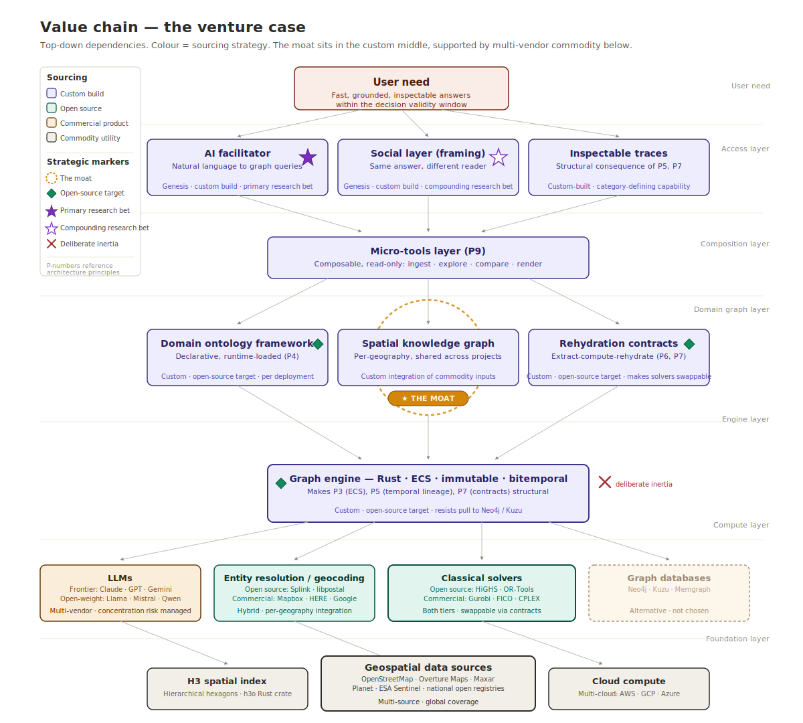
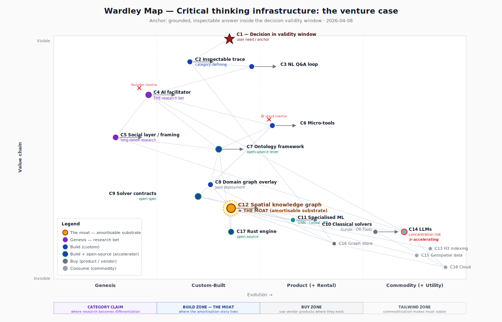
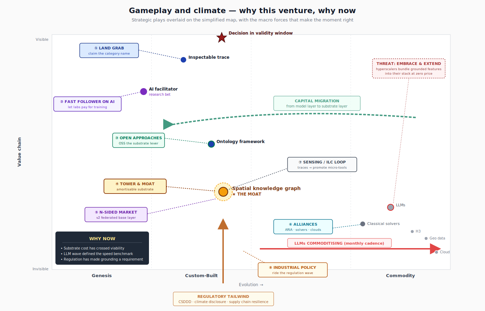
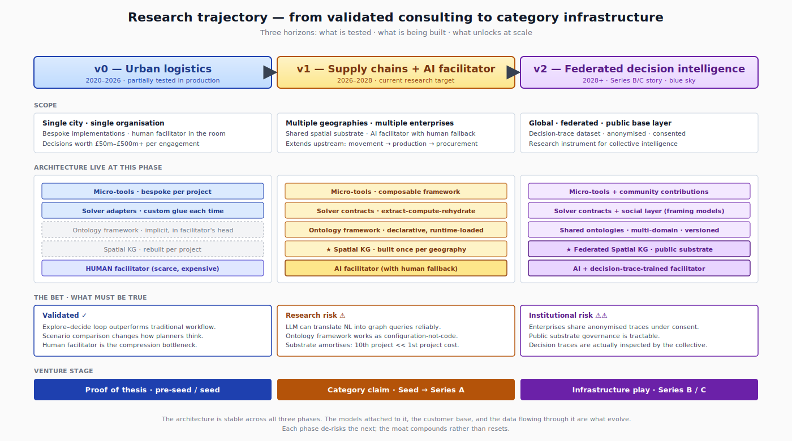

+++
title = "Mapping the venture case: a Wardley analysis of the architecture"
date = "2026-04-09"
draft = false
description = "A technical companion to the essay series. A Wardley mapping exercise applied to the four-layer architecture, locating the moat, identifying the components that should be open-sourced, and naming the events that would change the map."
+++

*A technical accompaniment to the [Deliberation Meets Reality](/posts/when-deliberation-meets-reality/) series, in which we analyse and position the platform as a commercially viable and venture backed initiative.*

## Abstract

The same architecture mapped from a venture-backed company perspective rather than a public infrastructure one. The exercise identifies where value is evolving on the stack, why the substrate layer (the graph engine, the domain ontology framework, the rehydration contracts) is underfunded relative to where capital will flow next, and which components should be open-sourced to accelerate the commodity tier rather than defended as proprietary. It names the moat, the build-buy-consume decisions that fall out of the geometry rather than out of preference, and the specific events that would force a revision of the map. Written as a technical piece in which the map does most of the argumentative work.

## Introduction

The preceding posts built an argument for critical thinking infrastructure fast enough to survive contact with reality, and they described the architecture that could deliver it. This post treats the same architecture as a commercial proposition and applies Simon Wardley's mapping method[^wardley] to work out where the venture case actually lives. It is written as a technical piece rather than as a narrative essay, and the map itself does most of the argumentative work.

## Why apply a Wardley map

The architectural arguments in the earlier posts can be defended on their own terms, but none of them answer the commercial question that eventually has to be answered, which is whether the architecture is worth building as a company rather than as a research project or a consultancy practice. What a Wardley map does better than the usual business frameworks is to make the relationship between components and their market maturity visible, so that build, buy, and consume decisions fall out of the geometry rather than out of preference. You identify the user and the user need, decompose the need into a chain of components, position each component on an axis of evolution from genesis through custom-built and product into commodity, and then read the resulting landscape for where the leverage sits. The exercise forces a kind of honesty that narrative strategy documents usually lack, because every component has to be placed somewhere on the axis, and the placement is publicly defensible or publicly wrong.

## Anchor, user, and scope

The primary user is a planning director or senior operational decision-maker at a logistics, supply chain, or network-intensive enterprise, and the characteristic situation is a decision that is high-stakes, time-boxed, and physical. Competitive tender responses worth hundreds of millions of pounds are one representative case, disruption response during a Red Sea diversion or a Suez blockage is another, and network redesign in response to a regulatory shift is a third. In all of these the decision-maker has weeks rather than months, the traditional analytical workflow cannot fit inside the window, and the default fallback when the tools run out of time is experience and spreadsheets. The first post in the series documented how consistently this fallback occurs even among decision-makers trained in structured analysis[^klein].

Expressed as an anchor for the map, the user need is the ability to ask a strategic question about a physical operation and receive a grounded, inspectable answer quickly enough to act inside the decision validity window. Grounded means the answer traces back to specific data in a structured knowledge graph rather than to a language model's parametric memory. Inspectable means the reasoning behind the answer can be reconstructed later by anyone with access to the trace. Quickly means inside the window during which the decision is still relevant to the landscape it was made against. The scope of the exercise is deliberately narrow: it treats the architecture as the basis for a venture-backable company rather than as a research programme or a public infrastructure argument, both of which would require a different map.

## The value chain

*The value chain is the first artefact the mapping method produces, and it captures the dependency structure of the architecture before any market-maturity axis is added. Each box is a component the user need depends on, the arrows run downward to show what depends on what, and the colours indicate how each component is sourced. Strategic markers overlay the structure: the gold dashed ring identifies the spatial knowledge graph as the moat, the green diamonds identify the three components recommended for open-sourcing, the filled star marks the AI facilitator as the primary research bet, and the outlined star marks the social layer as a compounding research bet that can mature on a longer timescale. The red cross on the graph engine is the deliberate inertia marker, noting that the company resists the mainstream pull to swap the custom Rust engine for an off-the-shelf graph database even though the alternative exists. The Wardley map in the next section takes this same dependency structure and adds the evolution axis, which is the move that turns the value chain into a strategy artefact.*

Working down from the user need, eighteen components carry the chain from the visible surface of the system to the hidden substrate. At the top is the decision within the validity window, which is the anchor itself. Directly below the anchor is the inspectable reasoning trace, which the decision-maker uses to defend the choice and which the collective uses to hold the choice to account. Below the trace is the natural-language question-and-answer loop, the interface the planner actually interacts with.

Underneath the interface layer sit the components that make the loop work. The AI facilitator translates natural-language questions into structured queries against the loaded ontology. The social layer selects the right projection of the answer for the reader based on their learned framing. The micro-tools layer provides the composable, read-only operations that handle the work specific to each question. The domain ontology framework defines which node and edge types are meaningful for a given deployment[^guarino], and the domain graph overlay carries the client-specific operational data parameterised against the base graph.

The integration layer follows. Solver integration contracts specify the extract-compute-rehydrate pipeline that keeps classical solvers composable, drawing on forty years of design-by-contract practice[^contract]. The classical solvers themselves, which include mixed-integer programming, constraint programming, and network-flow libraries, sit at the same level as specialised machine learning models such as graph neural networks, causal inference libraries, and entity resolution tools. Neither category is part of what the company builds, though both are part of what it uses.

At the bottom of the chain is the stable substrate. The spatial knowledge graph captures the physical reality of a geography by fusing data from government registries, crowdsourced mapping platforms, satellite imagery, and structured knowledge bases. Underneath it are the H3 hexagonal spatial indexing system[^h3], authoritative geospatial data sources, the immutable temporal graph store that implements the write layer, and the Rust engine and graph primitives that form the domain-agnostic core. General-purpose large language models and cloud compute sit at the very bottom as commodity substrate that everything else rents.

The dependency relationships are straightforward. Each layer depends on the one below it, the spatial knowledge graph acts as a shared foundation that the domain graph, the solver adapters, and the specialised machine learning models all read from, and nothing in the chain has a circular dependency. The absence of cycles is a consequence of the architectural principles documented separately[^principles] rather than a coincidence of the decomposition.

## The map

*The full eighteen-component map. The moat sits at C12, the spatial knowledge graph, and is surrounded by a dashed highlight. The research bets (C4, the AI facilitator, and C5, the social layer) sit at the far left in purple. The commodity tailwind components (H3 indexing, language models, geospatial data, and cloud compute) sit at the far right in light grey. Components marked with a green border are the ones recommended for open-sourcing as part of the strategy, and the rationale is discussed later in the post.*

The four annotation bands under the evolution axis summarise what the map claims. The genesis zone is where the research bets live and where the category claim is made, because a company trying to define a new category needs at least one component on the left side of the map. The custom-built zone in the middle is where the build investment concentrates, because the components there are understood well enough to be engineered reliably but not well enough for there to be off-the-shelf products. The product zone to the right is where classical solvers and temporal graph stores sit, which is where the company buys rather than builds. The commodity zone on the far right contains the components that commoditised earlier and that now provide the economic tailwind for everything above them.

The spatial knowledge graph is the component I have marked as the moat, and its position in the custom-built zone is deliberate. If it were in genesis, it would be a research project rather than a commercial asset, because nothing in genesis is reliable enough to amortise across projects. If it were in the product zone, it would be something to buy rather than build, because the existence of products means the category has a defined shape and multiple vendors are competing on it. The custom-built position is the one where the component is understood well enough to be engineered reliably, rare enough that no vendor is offering it yet, and valuable enough that building it once and reusing it across projects changes the economics of the business.

The research bets at the far left, specifically the AI facilitator and the social layer, are the components that have to cross from genesis into custom-built during the venture funding window. If they fail to cross, the company reverts to a consulting engagement model that does not scale as software, and the venture case collapses into a services business. The commodity zone on the far right is mostly populated with components that are themselves moving rightward at unusual speed, and language models in particular are commoditising at a pace that is unusual in software history.

## Positioning and its logic

The evolution axis is where most mapping errors happen, and the positions are market-relative rather than internal-capability-relative. A component that is routine for the team but novel in the market belongs in genesis or custom-built; a component that is exotic for the team but routine in the market belongs in product or commodity.

The inspectable reasoning trace sits at the boundary between genesis and custom-built. Related concepts exist in the compliance literature and in the machine learning explainability literature, and audit trails for database transactions are a mature engineering discipline, but there is no product category for reasoning traces as the substrate of decision support. The natural-language question-and-answer loop sits slightly further to the right, because the commodity experience of talking to a language model is now universal while the domain-grounded version that runs against a loaded ontology remains custom. The AI facilitator sits closer to the genesis-to-custom boundary, because translation from natural language into compositions of graph queries, solver invocations, and micro-tool calls against a loaded ontology has not been demonstrated at production reliability anywhere I am aware of, even if recent work on tool-use training has moved the problem closer to tractability[^toolllm]. The social layer sits further left still, reflecting the distance between the published methods for stance and framing extraction[^stance] and the engineering work required to make them dependable inside a live decision support system.

The domain ontology framework, the solver integration contracts, and the Rust engine primitives all sit in the custom-built zone. Ontologies and design-by-contract are mature ideas, but the specific configurations that make them useful for runtime-loaded, engine-agnostic decision support are not a product category, and the Rust position reflects a deliberate language choice for correctness and predictable performance rather than a default. The classical solvers sit in the product zone bordering commodity, because Gurobi, FICO, IBM CPLEX, Google's OR-Tools, and the HiGHS project are well-understood products with stable APIs, and recent work has shown they continue to outperform learned approaches on well-structured combinatorial problems[^solvers]. The specialised machine learning models sit between custom-built and product, because libraries like PyTorch Geometric, DoWhy, and Splink are mature while their applications in supply chain and logistics remain bespoke[^kosasih].

The commodity zone contains H3 indexing, language models, geospatial data, the temporal graph store, and cloud compute. Each of these is something that would have been custom or impossible to use at scale a decade ago and is now a utility, and their commoditisation is the most important climatic force on the map.

## How the landscape is moving

Static positions are only half of what a Wardley map encodes. The other half is movement, which is determined by climatic patterns acting on the map from outside. Five patterns matter here, and they interact in ways that determine the timing of the venture case.

The first is that everything evolves through supply and demand competition, and components do not stay in their current zone indefinitely. The AI facilitator, currently at the genesis-to-custom boundary, will be a product within roughly twenty-four to thirty-six months whether we push it there or not. The question the map forces is whether the company is the one that defines what the product looks like, or a late entrant to a category someone else has already shaped. First movers in newly forming categories have a specific advantage that fast followers rarely replicate, because the vocabulary of the category is set by the people who name it first, and once the vocabulary has stabilised the cost of displacing it is high.

The second pattern is that efficiency enables innovation. The commoditisation of cloud compute, of language models, of H3, and of open geospatial data has compressed the cost of building the spatial substrate by roughly an order of magnitude over the last decade. A spatial knowledge graph for a city the size of Singapore would have cost more to build in 2016 than any single tender was worth, because the underlying components were themselves expensive. In 2026 the marginal cost of adding a new geography is small enough that the investment amortises across projects within a year or two. The reason the architecture is buildable now is not that the idea is new, it is that the components below it have crossed the commodity threshold.

The third pattern is that capital flows to new areas of value as evolution continues. Over the last three years capital has flooded into the model layer and into the vertical-AI application layer, while the layer in between, where grounded substrate and inspectable infrastructure sit, has been comparatively underfunded. As the model layer commoditises and the application layer consolidates around a handful of winners, the value migrates downward to the substrate, and positioning the company as substrate-native now means being in place when the capital arrives.

The fourth pattern is that future value is inversely proportional to certainty. The components with the highest commercial upside are also the ones with the highest research risk, which is why the AI facilitator and the social layer both sit in genesis. An investor who waits for the research to be de-risked will be entering a category that has already formed. The genesis components are the venture bet, and the commodity components are the economics that make the bet viable.

The fifth pattern is the peace-war-wonder cycle. Decision support has been in the tail of a peace phase for most of the last decade, characterised by mature business intelligence tools and incremental improvements. The language model disruption has pushed the category into a war phase, in which the shape of the category is being renegotiated, incumbents with product-stage offerings are exposed, and new architectures displace old ones. War phases tend to close quickly, because categories consolidate around a handful of companies within a few years of the transition, and the window for claiming a new category name inside a war phase is open now rather than indefinitely.

## Plays that earn their place

*A simplified view of the map with the eight strategic plays that follow from the analysis and the three macro forces that determine the timing.*

The gameplay catalogue in the mapping literature associates each play with the conditions under which it is appropriate, and the plays that follow from this map are a specific subset of the available moves rather than a generic list. Eight of them earn their place here.

The first is the land grab. The category language is being set in the present, and the company that defines it first has an advantage the second-place entrant does not, because vocabulary is sticky once it has been adopted. The claim being staked is that the category is grounded, inspectable decision infrastructure, and not AI agents for operations or enterprise language model copilots. The essay series itself is part of the land-grab move, because it establishes the vocabulary that would later appear in product materials and investor conversations.

The second is first mover on the substrate combined with fast follower on the model layer. The company does not need to invent the underlying language models, which is work the frontier labs are paying for at a scale no venture can match. The play is to let them absorb the training cost and then compose their output into the grounded architecture. This inverts the strategy most vertical AI companies are following, which is to fine-tune a foundation model and treat the fine-tune as the moat. Fine-tunes are commoditising as fast as the models they are built on, while spatial knowledge graphs are not.

The third is the open approach, applied selectively. The domain ontology framework, the solver integration contract specification, and the Rust engine primitives are recommended for open-sourcing. None of these are the moat, and opening them accelerates the commoditisation of the layer directly under the moat (which makes the spatial knowledge graph relatively more valuable), fixes the vocabulary of the category around the company's own definitions (which is the language-level component of the land grab), and builds a community of contributors whose work improves the substrate without the company having to pay for it directly. The playbook is the one used by Red Hat with Linux, by MongoDB with the core database, and by Databricks with Spark.

The fourth is tower and moat, which is the central strategic move on the map. The tower is the spatial knowledge graph, the moat is the set of components that depend on it, and the configuration works because the central component is strong enough to anchor an ecosystem while the complementary services deepen the lock-in without requiring separate sales motions.

The fifth is the N-sided market, which becomes available once enough enterprise customers are anchored to the substrate. The federated trajectory described in the earlier posts involves enterprises contributing anonymised decision traces and domain patterns, a public base layer serving all of them, and research institutions consuming the traces for collective flourishing research. This is a genuine multi-sided platform, and the play is to set it up once the first side is stable, which means it is a Series B or C move rather than a seed move.

The sixth is alliances. Three of them compound specifically: an alliance with the Advanced Research and Invention Agency through the Collective Flourishing programme, which brings credibility and non-dilutive funding; an alliance with the classical solver vendors, which positions the company as an orchestration layer that grows their usage rather than one that abstracts them away; and an alliance with one or more hyperscalers for managed hosting of the spatial knowledge graph, which brings infrastructure credibility at the cost of a dependency that has to be managed carefully.

The seventh is the sensing engine, sometimes called the ILC loop for innovate, leverage, commoditise. Every decision trace that passes through the system is a signal about which questions are being asked, and when a pattern recurs across customers, it becomes a candidate for promotion from a one-off micro-tool to a named compute adapter with a formal contract. The promotion mechanism is the architectural expression of the principle that materialisation is an economic decision rather than a structural one, and it means the platform compounds over time without requiring a heavyweight product roadmap.

The eighth is riding the regulatory tailwind. The EU Corporate Sustainability Due Diligence Directive[^csddd], the United Kingdom's supply chain resilience agenda, and the post-2024 climate disclosure mandates across multiple jurisdictions are all creating legal requirements for traceable, defensible reasoning about physical operations. The play is to align the company's messaging and product priorities with the regulatory tailwind rather than treating regulation as an external concern, because the regulatory alignment provides the buyer story that speed alone does not.

Three plays are worth recognising but not deploying. Embrace-and-extend by a hyperscaler or foundation model vendor is a predictable defensive move, and the defences are speed on category definition, the credibility of the public substrate narrative, the regulatory alignment a hyperscaler cannot replicate cleanly, and the architectural depth the essay series has been building up. A standards game by a large incumbent proposing a competing architecture is a likely second move, and the defence is to contribute to open standards early enough that the company's reference implementation is the most compliant one. Classical solver vendors are the most likely source of artificial constraints in the form of licence terms that make the contract-based integration pattern expensive, and the defence is to maintain the open-source solvers as first-class citizens so no single vendor can lever the platform against its own users.

## Build, buy, consume

Every component on the map has a sourcing decision, and the decisions follow the positions rather than preference. The components in genesis and custom-built that belong to the moat or support it directly are built in-house. That set includes the inspectable trace, the natural-language question-and-answer loop as a thin orchestration layer over rented substrate, the AI facilitator, the social layer, the domain graph overlays delivered per customer, the spatial knowledge graph itself, and the micro-tools framework. The components that commoditise the substrate layer and lock the category vocabulary (the ontology framework, the solver contracts, and the Rust engine) are built and then released under a permissive open-source licence.

The components in the product zone are bought. Classical solvers are consumed through vendor APIs or open-source libraries depending on the deployment, the temporal graph store is an existing product with temporal extensions, and the specialised machine learning models are built on top of libraries rather than from first principles. The components in the commodity zone are rented as utilities, which includes H3, language models (deliberately through multiple vendors to avoid concentration risk), geospatial data, and cloud compute on a multi-cloud basis.

The pattern is consistent across the chain. Build where the moat is, build and release where the ecosystem lever is, buy where products exist, consume where utilities exist. The largest single failure mode is attempting to build what should be bought, which is the classical mistake of assuming internal engineering effort is a substitute for commodity infrastructure. The second largest is the inverse, consuming something that should have been built and therefore missing the opportunity for a moat.

## The trajectory

*Three horizons for the company, each corresponding to a funding round and each requiring a different set of bets to be validated. The architecture is stable across all three phases, while the models attached to it, the customer base, and the data flowing through the system are what evolve.*

The venture case unfolds across three phases corresponding to three stages of company maturity and three different levels of institutional risk. The first phase has been partially tested in commercial deployments since 2020 and involves a single geography, a single customer organisation, and a human facilitator who knows both the system and the domain well enough to translate between them in real time. The validation at this phase covers the claims that the explore-decide loop produces measurably better plans than the traditional workflow, that the human facilitator role is critical to the compression of time-to-question and time-to-answer, and that scenario comparison changes how decision-makers think about problems.

The second phase is the current research target and involves multiple geographies, multiple customer organisations, and an AI facilitator that replaces the human facilitator for routine questions. The research bet is whether a language model can reliably translate natural language questions into compositions of graph queries and solver invocations against a loaded ontology, at a quality level that does not silently degrade the decision process through translation errors the decision-maker cannot detect. The bet is underwritten by keeping the human facilitator as a fallback during the transition. The second phase also requires the ontology framework to do what it claims, which is to allow a new problem domain to be added as a configuration file rather than as engineering work. If the ontology framework fails that test, the company has a product rather than a platform, and the unit economics are closer to a consultancy than to a software business.

The third phase is currently blue sky. It involves a federated version of the spatial knowledge graph shared across organisations, a decision-trace dataset accumulated with consent and anonymisation, and a social layer that uses the traces to learn the framings of both the decision-makers in the room and the collectives the decisions will reach. The bets at this phase are institutional rather than technical, and none of them are testable before the first two phases have matured. The honest framing is that the third phase is the Series B or C story rather than the seed or Series A story.

The most important architectural property of the trajectory is that the base layers are stable across all three phases. The spatial knowledge graph is the same component in version zero as in version two, even though the version two instance has different governance, different scale, and different data flowing through it. This stability is what makes the trajectory a trajectory rather than three separate product bets, and it is also what allows each phase to de-risk the next.

## Decisions the map makes, and risks that would revise it

Five decisions fall out of the map directly. The moat is the spatial knowledge graph, because it is the only component that simultaneously sits in custom-built, amortises across projects, and depends on components commoditising in the company's favour. The open-source targets are the ontology framework, the solver contract specification, and the Rust engine, because those are the components whose commoditisation is happening anyway and that can be converted into a lever the company controls. The consume-rather-than-build list includes classical solvers, language models, and cloud compute, because building any of them would be recapitulating mature engineering for no commercial return. The load-bearing research bet is the AI facilitator rather than the social layer, because the facilitator has to mature for the company to scale beyond the human-facilitator model while the social layer is a compounding advantage that can mature on a longer timescale. And the timing is now rather than any other recent or future moment, because the substrate has only just crossed the commodity threshold, the language model disruption has only just set the speed benchmark, and the regulatory tailwind has only just made inspectability a compliance requirement.

Four risks would break the case, and each of them has a defence that is specific enough to be tested rather than hoped for. If the AI facilitator fails to cross from genesis into custom-built inside the funding window, the company reverts to a consulting engagement model, and the mitigation is to retain the human facilitator as a fallback during the transition in the same way self-driving car programmes retain safety drivers. If users turn out not to value inspectability enough to pay the marginal cost of grounding, the buyer of inspectability has to be someone other than the user, and the regulatory tailwind from the Corporate Sustainability Due Diligence Directive provides that alignment in the supply chain vertical while leaving open the question of whether the alignment holds elsewhere. If a hyperscaler or foundation model vendor attempts an embrace-and-extend move, the defences are category claim speed, public substrate credibility, regulatory alignment, and architectural depth. If founder inertia keeps the company optimising the tested human-facilitator model rather than committing to the AI facilitator transition, the mitigation is organisational: the AI facilitator has to be the highest-priority research investment from the start, with a milestone-driven plan and an explicit decision point at which the company either commits further or pivots back to the services model.

The events that would revise the map are specific enough to be watched for. A step change in language model capability that collapses the research risk on the AI facilitator would move the component from genesis into custom-built, and the venture case becomes stronger on the same map. A hyperscaler announcing a grounded decision infrastructure product would move the category into war phase earlier than expected, and the speed of category claim becomes more important. A regulatory retrenchment on the supply chain disclosure mandates would weaken the tailwind and require a new buyer story. A significant disruption event, such as a Red Sea closure persisting for months rather than weeks, would force enterprises to pay for rapid scenario comparison at a price that accelerates the commercial case. Each of these events would prompt a revision of the map rather than a defence of it, because the value of a map lies in how quickly it can be redrawn and not in how stable it looks on the wall.

## Closing

The exercise has done what it was supposed to do, which is to make the venture case legible in terms that can be defended with geometry rather than narrative. The moat is the spatial knowledge graph as an amortisable substrate. The research bet that has to mature for the commercial case to work is the AI facilitator. The commodity layer below the moat is a tailwind rather than a threat, and the selective open-source strategy is the lever that converts the tailwind into structural advantage. The regulatory environment is a real force rather than a hoped-for one, and it provides the buyer alignment that the speed argument alone would not. None of this guarantees that the venture case works. What it is, is a map that names the places where the case would break and the events that would change the map, which is a more honest output than a strategy deck would be at the same stage, because it is structured to be revised when the territory moves rather than defended when the territory has already moved underneath it. The map belongs to the same family of artefacts as the hypothesis register: it is a live document whose value depends on how often it is updated.

[^wardley]: Wardley, S. (2016) *Wardley Maps: Topographical Intelligence in Business*. Available as a collection on Medium at [https://medium.com/wardleymaps](https://medium.com/wardleymaps) (Accessed: 9 April 2026). The full mapping method, including the evolution axis definitions, the gameplay catalogue, the climatic patterns framework, and the peace-war-wonder cycle, is developed across the collected essays. For the connection between Wardley mapping and the question-answer iteration thesis that runs through this series, see also Girba, T. and Wardley, S. (2024) *Rewilding Software Engineering*. Available at: [https://medium.com/feenk/rewilding-software-engineering-25ba0e141e69](https://medium.com/feenk/rewilding-software-engineering-25ba0e141e69) (Accessed: 9 April 2026).

[^klein]: Klein, G. (1998) *Sources of Power: How People Make Decisions*. Cambridge, MA: MIT Press. Available at: [https://mitpress.mit.edu/9780262611466/sources-of-power/](https://mitpress.mit.edu/9780262611466/sources-of-power/) (Accessed: 9 April 2026). The naturalistic decision-making research programme documents how domain experts under time pressure rely on recognition-primed decision-making rather than on structured comparison of options. A recent systematic review confirming the finding across 32 empirical studies is Reale, C. et al. (2023) 'Decision-making during high-risk events: a systematic literature review', *Journal of Cognitive Engineering and Decision Making*, 17(2), pp. 188–212. Available at: [https://doi.org/10.1177/15553434221116822](https://doi.org/10.1177/15553434221116822).

[^guarino]: Guarino, N. (1998) 'Formal ontology and information systems', in Guarino, N. (ed.) *Formal Ontology in Information Systems: Proceedings of FOIS'98*. Amsterdam: IOS Press, pp. 3–15. Available at: [https://www.loa.istc.cnr.it/old/Papers/FOIS98.pdf](https://www.loa.istc.cnr.it/old/Papers/FOIS98.pdf) (Accessed: 9 April 2026). The foundational treatment of ontologies as runtime-loaded system components, and the distinction between formal ontology and conceptual modelling that separates domain ontology from stakeholder framing in the architecture.

[^contract]: Meyer, B. (1992) 'Applying "design by contract"', *Computer*, 25(10), pp. 40–51. Available at: [https://se.inf.ethz.ch/~meyer/publications/computer/contract.pdf](https://se.inf.ethz.ch/~meyer/publications/computer/contract.pdf) (Accessed: 9 April 2026). The principles Meyer laid out for preconditions, postconditions, and invariants are the basis for the rehydration contract pattern used at the solver integration layer. For a recent application of contract-style enforcement to machine learning pipelines, see Schelter, S. (2022) 'Screening native ML pipelines with "ArgusEyes"', in *Proceedings of CIDR '22*. Available at: [https://www.cidrdb.org/cidr2022/papers/a1-schelter.pdf](https://www.cidrdb.org/cidr2022/papers/a1-schelter.pdf) (Accessed: 9 April 2026).

[^h3]: Brodsky, I. (2018) 'H3: Uber's hexagonal hierarchical spatial index', *Uber Engineering Blog*, 27 June. Available at: [https://www.uber.com/en/blog/h3/](https://www.uber.com/en/blog/h3/) (Accessed: 9 April 2026). Hexagonal grids are superior to square grids for spatial analytics because every neighbouring cell is equidistant from the centre, which is the basis for placing H3 in the commodity zone of the map. For recent work on urban network analysis that builds on H3-style spatial indexing, see Boeing, G. (2025) 'Modeling and analyzing urban networks and amenities with OSMnx', *Geographical Analysis*, published online ahead of print. Available at: [https://doi.org/10.1111/gean.70009](https://doi.org/10.1111/gean.70009).

[^solvers]: For the current state of classical solvers and their relationship to learned optimisation approaches, see Da Ros, F., Soprano, M., Di Gaspero, L. and Roitero, K. (2025) 'Large Language Models for Combinatorial Optimization: A Systematic Review', *ACM Computing Surveys*. Available at: [https://doi.org/10.1145/3801961](https://doi.org/10.1145/3801961). The review synthesises 103 studies and situates language models as useful for problem formulation, heuristic generation, and algorithm selection rather than for direct solving, which supports placing classical solvers in the product zone and language models in the commodity zone of the map.

[^kosasih]: Kosasih, E.E., Margaroli, F., Gelli, S., Aziz, A., Wildgoose, N. and Brintrup, A. (2024) 'Towards knowledge graph reasoning for supply chain risk management using graph neural networks', *International Journal of Production Research*, 62(15), pp. 5596–5612. Available at: [https://doi.org/10.1080/00207543.2022.2100841](https://doi.org/10.1080/00207543.2022.2100841). The paper is representative of the current state of graph neural network application to supply chain knowledge graphs and supports the placement of specialised machine learning models in the custom-to-product transition zone.

[^toolllm]: For the current state of tool use and function calling in large language models, which is the capability the AI facilitator's translation task depends on, see Qin, Y. et al. (2024) 'ToolLLM: Facilitating large language models to master 16000+ real-world APIs', in *Proceedings of ICLR 2024*. Available at: [https://openreview.net/forum?id=dHng2O0Jjr](https://openreview.net/forum?id=dHng2O0Jjr) (Accessed: 9 April 2026). The paper is representative of the rapid progress on tool-use training that has moved the AI facilitator problem from implausible to plausible in the last eighteen months, without moving it all the way to reliable for production decision support.

[^stance]: For the natural language processing methods underlying the social layer, see Mohammad, S.M., Sobhani, P. and Kiritchenko, S. (2017) 'Stance and sentiment in tweets', *ACM Transactions on Internet Technology*, 17(3), pp. 1–23. Available at: [https://doi.org/10.1145/3003433](https://doi.org/10.1145/3003433). For argumentation mining in user-generated web discourse, see Habernal, I. and Gurevych, I. (2017) 'Argumentation mining in user-generated web discourse', *Computational Linguistics*, 43(1), pp. 125–179. Available at: [https://doi.org/10.1162/COLI_a_00276](https://doi.org/10.1162/COLI_a_00276).

[^csddd]: European Parliament and Council of the European Union (2024) *Directive (EU) 2024/1760 of the European Parliament and of the Council of 13 June 2024 on corporate sustainability due diligence*. Brussels: Official Journal of the European Union. Available at: [https://eur-lex.europa.eu/eli/dir/2024/1760/oj](https://eur-lex.europa.eu/eli/dir/2024/1760/oj) (Accessed: 9 April 2026). The directive provides for fines of up to 5% of worldwide turnover for non-compliance with supply chain due diligence obligations, and its existence is the primary evidence for the regulatory tailwind described in the climatic patterns section.

[^principles]: The architectural principles referenced throughout, including the immutability of temporal lineage, the separation between stable and volatile layers, the prohibition on behaviour in data objects, and the treatment of materialisation as an economic decision rather than a structural one, are documented in the [Core Principles and Architectural Decisions reference document](/builds/critical-thinking-infrastructure/). The principles are stable and revised only in response to new failure modes or to changes in the underlying business problem.
