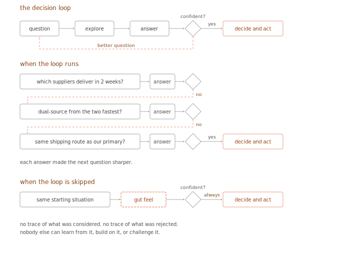
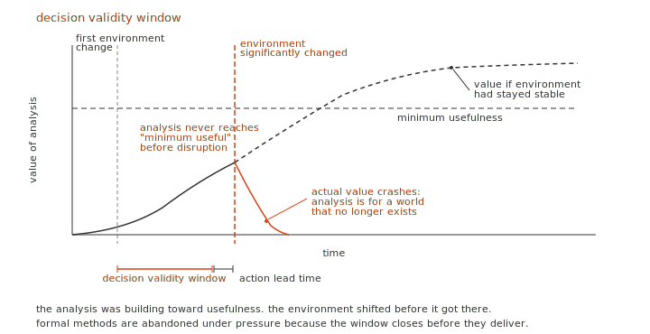
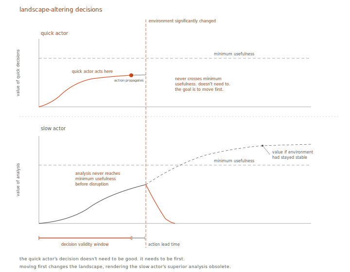
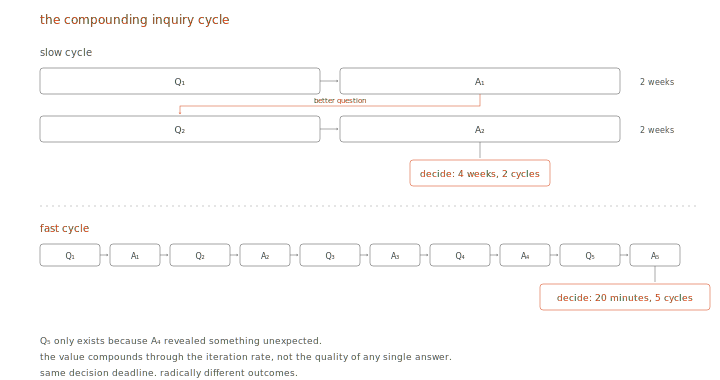
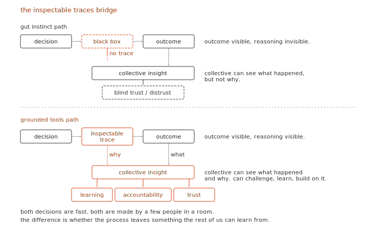

+++
title = "When Deliberation Meets Reality"
date = "2026-03-31"
description = "A response to ARIA's Collective Flourishing opportunity space. The missing precondition for collective flourishing is critical thinking infrastructure that operates fast enough to survive contact with reality."
+++

*A response to ARIA's Collective Flourishing opportunity space*

ARIA's Collective Flourishing programme, led by Dr Nicole Wheeler, asks an important question: what if we could build the tools that allow societies to move from reactively correcting the past to consciously creating the future? The [opportunity space document](https://www.aria.org.uk/media/qvhfnuta/aria-collective-flourishing-opportunity-space_accessible.pdf) identifies a real problem, that our tools for navigating complexity have not kept pace with the world, and proposes "deliberative scaffolding" as the solution: tools and protocols that help societies see, reason, and choose together.

I agree with the diagnosis. As a first draft, I feel there are critical aspects not yet addressed: the role of decision speed (chronically underestimated) and the viability of collective deliberation under real-world pressure (often overestimated). And then the scientific question underneath both: why analytically superior methods are universally abandoned when they matter most. To be fair, this is incredibly difficult to study scientifically. It has to be tested in high-pressure environments with real stakes, which is not a setup that lends itself to controlled experiments. What follows is a constructive critique, developed alongside my own work on spatial knowledge graphs and AI-augmented decision support for supply chain systems.

The core argument: the missing precondition for collective flourishing is critical thinking infrastructure that operates fast enough to survive contact with reality. Fast question-answer tools that compress months of analysis into minutes, compound through rapid iteration, and leave inspectable traces that the collective can learn from, challenge, and use to hold decision-makers accountable.

## How decisions actually work

*Hypothesis: the quality of a decision is determined by the number of question-answer iterations before it, not the brilliance of any single answer.*

Every decision requires action, but before acting, there are questions. We have a hypothesis about how something works or what might happen. We explore, have conversations, gather data, and get answers. If we're confident in those answers, we decide and act. If not, we refine the hypothesis and go again. This is the scientific method, simplified.

And good answers open better questions. A manufacturer asking "which suppliers can deliver within two weeks?" gets an answer, and that answer leads to "what if we dual-source from the two fastest?" which leads to "is the cheaper option dependent on the same shipping route as our primary?" Each question is sharper than the last, and each only exists because the previous one was answered. The quality of the final decision tracks the number of these iterations, not the brilliance of any single answer.

Now replace that cycle with gut feel. An experienced executive walks into a room, looks at the situation, and decides based on gut. The business ends up doing well, but research shows it's mostly due to luck[^8]. The executive gets the credit anyway. And the process leaves nothing behind: no trace of what was considered, what was rejected, what assumptions were tested. Nobody else can learn from it or challenge it, and when they're wrong, nobody can reconstruct why.

This matters when the stakes are high. Bad decisions on infrastructure placement waste millions. Bad decisions on supply chains during a crisis cascade through thousands of businesses. Bad decisions on climate policy affect billions. The difference between good and bad decisions at scale is whether the question-answer cycle ran properly or got skipped.

# Part 1: why current approaches fail under pressure

## The field is not under-explored. The question is why nothing works.

*Hypothesis: collective decision-making methods are not under-explored. The under-explored question is why they are universally abandoned under pressure.*

ARIA requires that an opportunity space be "under-explored relative to its potential impact." But collective decision-making has been extensively studied for decades. Multi-criteria decision analysis, problem structuring methods, Delphi, scenario planning, deliberative democracy platforms. The toolkit is large and mature. The academic literature on wicked problems dates to Rittel and Webber in 1973[^1]. Polis, cited in Wheeler's own bibliography, has been running since 2014 and was deployed in Taiwan's vTaiwan process in 2015. Fuzzy cognitive maps date to the 1980s.

These methods work in idealised, low-pressure environments. The moment things get critical and tough, people revert to gut feel and spreadsheets. Klein's research on naturalistic decision-making confirmed this across firefighters, military commanders, and ICU nurses: experts under pressure don't compare options analytically, they recognise patterns and satisfice[^9]. During Hurricane Katrina, FEMA's centralised planning process couldn't figure out how to move supplies into New Orleans. Walmart, using decentralised decision-making and the same logistics infrastructure it runs every day, had trucks of water and food past the roadblocks two days before the government showed up. The CEO's instruction to staff was simple: make the best decision you can with the information available to you[^2].

What is genuinely under-explored is a scientific question: why are analytically superior methods universally abandoned when they matter most?

## The speed contradiction

*Hypothesis: the binding constraint on decision quality is not analytical rigour but decision speed.*

Wheeler's document talks about helping societies "see, reason, and choose together." But "together" implies consensus processes, and consensus is slow by design. Democracy is slow by design. Multi-criteria deliberation is slow by design. And the same document identifies a world becoming more volatile, with increasing risk of polycrises.

These two claims are in tension.

Under crisis conditions, the neurological switch from System 2 (analytical) to System 1 (intuitive) processing is a biological constraint. Yu's SIDI model, published in *Neurobiology of Stress* (2016), provides the evidence: stress forces diminished prefrontal executive control and exaggerated subcortical reactive activity[^3]. Deliberative scaffolding doesn't change the neuroscience. The only intervention that works is compressing analytical reasoning to fit within the decision window.

Wheeler's own framing hints at this tension, asking how we can coordinate actors to act "quickly and with an awareness of possible outcomes." The word "quickly" is doing a lot of work there, and the opportunity space would benefit from giving it more room.

## Simple stories win because they are fast, not because people are stupid

*Hypothesis: the preference for simple stories is a rational adaptation to time pressure, not a cognitive bias.*

The document observes that "complexity and uncertainty are uncomfortable, so we favour simple stories and confident answers, even when they are wrong." This is presented as a cognitive bias to overcome.

I think the framing is wrong. Simple stories and confident answers are quick. The preference for simple stories is probably a rational adaptation to time pressure. Complex stories take too long to construct and communicate. Gigerenzer's research on heuristic decision-making supports this: in many real-world conditions, ignoring part of the information leads to more accurate judgments than weighting and integrating everything[^10].

If that's true, the solution changes. You don't teach people to tolerate complexity. You make complex answers as fast to access as simple ones.

## In landscape-altering environments, slow decisions become wrong decisions

*Hypothesis: in environments where decisions alter the landscape, slow decisions are not merely late. They are wrong.*

In any environment where decisions alter the decision landscape, the value of a decision degrades over time. A perfect decision made after the landscape has shifted is worse than a good-enough decision made while the landscape still matches the one you analysed. Slow deliberation produces analyses of a world that no longer exists.

Boyd understood this in military contexts. The OODA loop works because your decision changes your opponent's landscape, forcing them to re-orient. The actor with the faster loop makes the slower actor's in-progress analysis obsolete[^4]. Boyd was talking about adversarial dyads. In multi-stakeholder systems (supply chains, climate policy, urban planning), everyone's decisions are simultaneously changing everyone else's landscape.

This gives rise to the concept of a *decision validity window*: the time period during which an analysis of the current landscape remains accurate enough to act on. In stable environments (academic research, infrastructure planning, constitutional design), this window is months or years, and deliberation works. In volatile, coupled environments (supply chain crises, competitive markets, geopolitical shocks), this window is hours or days, and deliberation cannot fit. Eisenhardt's study of strategic decision-making in high-velocity industries found that fast decision-makers use more information, not less, and that speed and quality are not trade-offs: fast decisions led to superior performance[^11].

C-level executives are, by selection, critical thinkers. They are trained in structured analysis, have access to sophisticated tools, and face decisions with enormous consequences. And yet, under time pressure (competitive public tenders, supply chain disruptions, market shifts), they consistently fall back to gut feel and instincts. And sometimes they excel doing so. The environment does not permit the time critical thinking requires.

There is also a competition for attention. In practice, a gut-feel answer and an analytical answer are often racing for the same decision-maker. A quick answer that leads to a follow-up question outsprints a slow analytical answer. By the time the analytical answer comes through, the situation has moved on, and decision-makers are reluctant to reverse course and start over. The analytical method loses the room before it produces an answer.

## Collective progress is vulnerable to sabotage, and climate proves it

*Hypothesis: collective coordination without enforcement is systematically exploitable through tempo asymmetry.*

The opportunity space frames collective flourishing in terms of shared progress and coordinated action. Game theory tells us that any coordination mechanism without enforcement is vulnerable to defection. Olson's *Logic of Collective Action* established this formally: groups fail to coordinate for collective benefit even when it is in everyone's interest, because individual incentives favour free-riding[^12]. In supply chains, information sharing is the known solution to the bullwhip effect, and firms systematically refuse to do it because sharing information erodes competitive advantage[^5]. The EU Corporate Sustainability Due Diligence Directive is literally a regulatory attempt to force the coordination that the market will not produce voluntarily[^6].

But the sabotage problem goes deeper than defection. It is a problem of tempo.

Climate policy appears to be a counter-example to the speed thesis. It operates on multi-decade time horizons where slow deliberation should be appropriate. But consider the record: climate is the most thoroughly analysed, most extensively deliberated, most comprehensively modelled collective challenge in human history. And it has produced insufficient action. All the modelling, policy analysis, consensus, frameworks, and legislation is going to be extremely useful one day to understand why we failed to take action and prevent it. And therein lies the problem: it's not leading to action.

The primary mechanism is tempo asymmetry. Asking a question is cheap and fast: a press release, a funded study, a lobbying position. Answering it rigorously is expensive and slow: data collection, modelling, peer review, policy analysis. Adversaries exploit this. They don't need to produce better answers, they just need to produce more questions than the system can answer. Every unanswered question becomes justification for delay. "We need more research before we act" is the most effective obstruction strategy ever deployed, because it sounds like a call for rigour.

And divide-and-conquer layers on top. Once delay is established, you fragment the coalition. You don't attack the science, you attack the solution. Carbon tax versus cap-and-trade. Renewables versus nuclear. Mitigation versus adaptation. Each disagreement is genuine and worth debating, but the debate multiplies the questions, each requiring its own slow analysis cycle.

Climate is the strongest supporting case for the speed thesis. The long time horizon enabled more effective adversarial delay, not better deliberation.

The intervention follows directly: compress time-to-answer so that questions cannot be used as delay tactics. You cannot stall a process that answers questions faster than you can ask them.

# Part 2: what would actually work

## The missing iteration loop

*Hypothesis: the fundamental unit of progress in collective reasoning is the question-answer iteration. Value compounds with iteration speed.*

There is a pattern in the scientific method that the opportunity space does not address: the compounding inquiry cycle. More questions lead to more answers, which lead to better questions, which lead to better answers. The value is in the iteration rate[^7].

Looking through the ARIA document carefully, the framing is single-turn. The six themes (organising knowledge, evidence synthesis, value elicitation, wargaming, decision-making under uncertainty, cognitive autonomy) are treated as independent capabilities. The document never identifies the cycle between them, or the compounding value of rapid iteration, as the thing that needs to be accelerated.

When time-to-answer is large, all energy goes into finding answers, leaving almost nothing for finding questions. The questions are where the value is. The answers are the mechanism by which you earn the right to ask a better question[^7]. When time-to-answer collapses, you get different, better questions that you would never have thought to ask, because the previous answer revealed something unexpected.

This is the scientific method. Hypothesis, experiment, observation, revised hypothesis, better experiment. Breakthroughs come from environments that compress the experimental cycle: Faraday's bench experiments, Edison's Menlo Park, modern high-throughput drug screening. The scientific revolution was the formalisation of rapid, iterative empiricism.

Any system for collective flourishing that doesn't explicitly design for rapid cycling between understanding and action will produce the same single-turn outputs that have failed for decades.

## The bridge: fast grounded decisions enable collective learning; gut instinct does not

*Hypothesis: fast decisions made through inspectable tools enable collective learning. Gut-instinct decisions do not.*

Everything above seems like an argument against collective flourishing. Fast decisions by a few, slow deliberation irrelevant, sabotage inevitable. But that conclusion only holds if fast decisions are opaque. And gut-instinct decisions are opaque by definition.

Nobody, not the decision-maker, not their organisation, not the affected public, can reconstruct why a gut-instinct choice was made. "I had a feeling" is not inspectable. "The spreadsheet said so" is barely better. The assumptions are buried, the alternatives unexplored, the reasoning invisible. The collective is locked out because the decision process left no trace.

And it's a lose-lose for the decision-makers too. Many situations require quick decisions by a few key people, and those people can and should be held accountable by the collective. But right now they can't rely on anything other than gut feel, and when they're wrong, they can't defend their actions. The ones who thrive are the ones who happen to be right, which over time becomes a game of chance. Or the ones who claim they are always right, despite evidence to the contrary. The need for inspectable tools cuts both directions: the collective needs them for accountability, and the decision-makers need them for defensibility.

Now consider the alternative. Decisions made through structured tools operating on knowledge graphs, with minimised time-to-question and time-to-answer. The decision itself is still fast, minutes not weeks. It may still be made by a few people in a room. But the process leaves a complete, inspectable trace: the question asked, the data queried, the scenarios compared, the trade-offs evaluated, the alternatives considered and rejected. Every step is grounded in queryable evidence, not narrative.

That trace becomes the substrate for collective understanding. After the fast decision, the collective can inspect the reasoning. They can ask: why was option B rejected? What assumptions drove the scenario comparison? What would have changed if we weighted environmental impact more heavily? These are queries against the same evidence infrastructure that supported the original decision. The collective isn't second-guessing in the dark. They're engaging with the actual reasoning, grounded in the actual evidence.

And this addresses the sabotage problem. Opaque decisions by powerful actors are unaccountable by nature. Decisions made through inspectable, grounded tools are accountable by construction. A corporation that claims "we had no alternative" can be challenged with the same evidence that shows what alternatives existed.

Wheeler's vision of collective flourishing, where societies see, reason, and choose together, doesn't require that every decision be made collectively in real time. It requires that decisions, however fast and however narrow the decision-making group, produce reasoning that the collective can inspect, learn from, and use to hold decision-makers accountable.

## The missing precondition

The under-explored gap is why analytically superior methods are universally abandoned when they matter most. The answer is the decision speed gap: any tool that operates slower than the decision cycle gets bypassed.

The missing precondition for collective flourishing is critical thinking infrastructure: systems that make it cheap and fast to question assumptions, test claims against structured evidence, and explore counterfactual futures. Tools that help people think harder without it being slower.

Understanding without action is enlightenment. Action without understanding is recklessness. Understanding that arrives after the action window has closed is irrelevant. The challenge is compressing rigorous, iterative understanding into the action window, and doing it in a way that leaves a trace the rest of us can learn from.

Wheeler's deliberative scaffolding vision is incomplete. The scaffolding needs a foundation, and that foundation is the ability to reason rigorously at the speed the world demands.

---

[^1]: Rittel, H.W.J. and Webber, M.M. (1973). Dilemmas in a General Theory of Planning. *Policy Sciences*, 4(2), 155–169. For a 52-year retrospective confirming the enduring influence of the framework, see Peters, G., Head, B.W., Danaeefard, H. & Khosravi, M. (2026). What Do We Know About Wicked Problems After Nearly 52 Years? *Administration & Society*.

[^2]: Horwitz, S. (2009). Wal-Mart to the Rescue: Private Enterprise's Response to Hurricane Katrina. *The Independent Review*, 13(4), 511-528. For context on the broader theory-practice gap in humanitarian logistics, see Laguna-Salvadó et al. (2023) in *Socio-Economic Planning Sciences*.

[^3]: Yu, R. (2016). Stress potentiates decision biases: A stress induced deliberation-to-intuition (SIDI) model. *Neurobiology of Stress*, 3, 83–95. The stress-decision link is confirmed across domains in Reale, C. et al. (2023). Decision-Making During High-Risk Events: A Systematic Literature Review. *Journal of Cognitive Engineering and Decision Making*, 17(2), 188-212.

[^4]: Boyd, J. (1987). A Discourse on Winning and Losing. For a supply chain application of OODA-loop thinking, see the contrast between Walmart's distributed rapid-response and FEMA's centralised deliberation during Hurricane Katrina, documented in Horwitz (2009), *The Independent Review*.

[^5]: Lee, H.L., Padmanabhan, V. and Whang, S. (1997). The Bullwhip Effect in Supply Chains. *Sloan Management Review*, 38(3), 93–102. Bullwhip dynamics were observed at global scale during COVID-19. For recent work on supply chain network contagion and systemic financial risk, see Fialkowski et al. (2025), arXiv:2502.17044.

[^6]: European Commission. Corporate Sustainability Due Diligence Directive (CSDDD). Fines of up to 5% of worldwide turnover for non-compliance with supply chain due diligence obligations. The existence of this legislation is itself evidence that voluntary collective coordination failed, consistent with Olson (1965).

[^7]: The question-answer iteration concept draws on Girba and Wardley's work on "rewilding software engineering," specifically their observation that when time-to-answer is large, organisational energy is consumed by finding answers rather than finding questions, and that the questions are where the value compounds.

[^8]: Fitza, M. (2014). The use of variance decomposition in the investigation of CEO effects: How large must the CEO effect be to rule out chance? *Strategic Management Journal*, 35(12), 1839-1852. Quigley, T.J. & Graffin, S.D. (2017) offered a rebuttal in the same journal, arguing the effect is significant; Fitza, M. (2017) responded with a counter-rebuttal. The debate continues, but both sides agree that industry and macroeconomic factors explain the majority of variance in firm performance. See also Keller, T. et al. (2023). The "CEO in context" technique revisited. *Strategic Management Journal*, 44(4), 1111-1138.

[^9]: Klein, G. (1998). *Sources of Power: How People Make Decisions*. MIT Press. See also Klein, G. (1993). A Recognition-Primed Decision (RPD) Model of Rapid Decision Making. In Klein, G. et al. (Eds.), *Decision Making in Action: Models and Methods*. Ablex Publishing. A 2023 systematic review of 32 empirical studies confirmed RPD in all studies that analysed decision-making strategy: Reale, C. et al. (2023). Decision-Making During High-Risk Events. *Journal of Cognitive Engineering and Decision Making*, 17(2), 188-212.

[^10]: Gigerenzer, G. & Gaissmaier, W. (2011). Heuristic Decision Making. *Annual Review of Psychology*, 62, 451-482. Extended to organisational decision-making in Gigerenzer, G., Reb, J. & Luan, S. (2022). Smart heuristics for individuals, teams, and organizations. *Annual Review of Organizational Psychology and Organizational Behavior*, 9, 171-198. See also Spiliopoulos, L. & Hertwig, R. (2024). Stochastic heuristics for decisions under risk and uncertainty. *Frontiers in Psychology*, 15, 1438581.

[^11]: Eisenhardt, K.M. (1989). Making Fast Strategic Decisions in High-Velocity Environments. *Academy of Management Journal*, 32(3), 543-576. Tested across multiple industries and environmental contexts in Shepherd, N., Mooi, E., Elbanna, S. & Rudd, J. (2021). Deciding Fast: Examining the Relationship between Strategic Decision Speed and Decision Quality across Multiple Environmental Contexts. *European Management Review*, 18(3).

[^12]: Olson, M. (1965). *The Logic of Collective Action: Public Goods and the Theory of Groups*. Harvard University Press. The 2007 Nobel Prize in Economics to Hurwicz, Maskin and Myerson for mechanism design theory confirms the centrality of Olson's collective action problem: the field exists because voluntary coordination systematically fails.
